# Exercise 1 - Explore and Configure SAP Integration Suite, advanced event mesh (AEM)

## Overview

To enable real-time grounding with an event-driven architecture, we use **SAP Integration Suite, advanced event mesh (AEM)**.<br/>
In this exercise, you will explore and familiarize yourself with AEM. Each participant needs to create 2 queues and subscribe to the relevant topic.
These queues will be used later in the session when creating or configuring integration interfaces in the Cloud Integration capability of SAP Integration Suite.

## Exercise 1.1 - Log on to SAP Integration Suite, advanced event mesh (AEM) and explore it
After completing these steps, you will have familiarized yourself with AEM. These steps will give you a first impression and an overview of AEM.

1. Log on to [SAP Integration Suite, advanced event mesh tenant](https://eu10.console.pubsub.em.services.cloud.sap/login?tenant-id=8b4a1697-2b58-4571-a986-1377cc070073) using the user ID and password that is already provided by the instructors.

2. Explore **SAP Integration Suite, advanced event mesh (AEM)** tenant.
   <br>Check out the areas in the AEM cockpit to discover the different categories of services AEM offers:

	- **Event Portal:** Event Portal provides event management services. This subscribed service provides powerful tools to create, design, share, and manage various aspects of an EDA based on event brokers or other streaming technologies (such as Kafka).

	- **Mission Control:** Mission Control makes it easy to deploy event brokers, create event meshes, and optimize and monitor the health/performance of an event-driven system. Mission Control is a section in the Cloud Console that permits you to access event brokers, visualize and manage your event broker services, and visualize and design event meshes. Mission Control has a Cluster Manager and Mesh Manager that permits you to create event broker services and manage your event mesh.

     	- **Cluster Manager:** event broker services are made available via Cluster Manager. Each event broker service consists of event brokers configured in a High-Availability (HA) setup.

	- **Event Monitoring and Insights:** With Insights, we provide curated dashboards, easy-to-understand visualizations based on historical and real-time metrics, and timely notifications about your event broker services. This advanced information allows you to identify problems before they occur and helps you to better manage your services as your EDA scales. You can work with SAP to configure your monitoring to meet your needs. For advanced monitoring requirements, there's a single entry point to build custom visualizations to meet your organization's requirements. Coupled with visualizations is a notification email framework that alerts you when key metrics fall outside of your established thresholds. These notifications allow you to monitor what's occurring and correct developing issues before they impact or degrade your EDA. You can configure these notifications to integrate with your existing notification and logging systems.

	

3. Click on **Cluster Manager**, and ensure that the **"Only show my services"** checkbox is unchecked.
   <br>Then, select the **teched-2025-europe** tile.

	  

4. On the right side of the screen, click the button labeled **Open Broker Manager**. It will open in a new browser tab or window.
   
	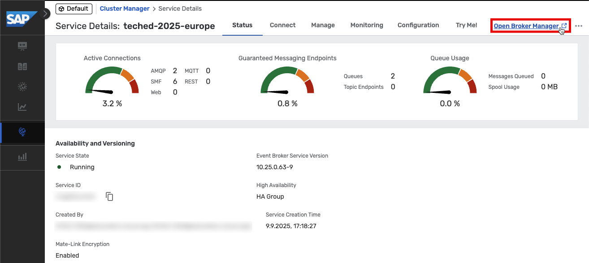  

5. Explore the **Broker Manager** screen.
   <br>On the left side of the screen, you will find the main sections for navigation:

	- **Message VPN:** VPN-level stats and config (a Message VPN is a virtual partition of a single broker. One AEM broker can host multiple Message VPNs, and each VPN can have different authorization schemes and topic spaces; client/messaging application activity happens within the scope of a VPN).
	- **Clients:** Information about connected and configured client applications.
	- **Queues:** Used for guaranteed/persistent messaging.
	- **Connector Wizards:** Used to connect to a variety of web services.
	- **Access Control:** Used to create new client usernames, access control profiles, and client profiles.
	- **Replay:** Used to enable replay functionality, to allow the broker to send previous messages again.
		> Note: AEM brokers do not use replay for recovery of persistent data (like Kafka). There is a more fine-grained approach in AEM where each individual message is Acknowledged to the broker when the consumer application is done with it.
	- **Try Me!:** Used to connect to WebSocket test applications.

	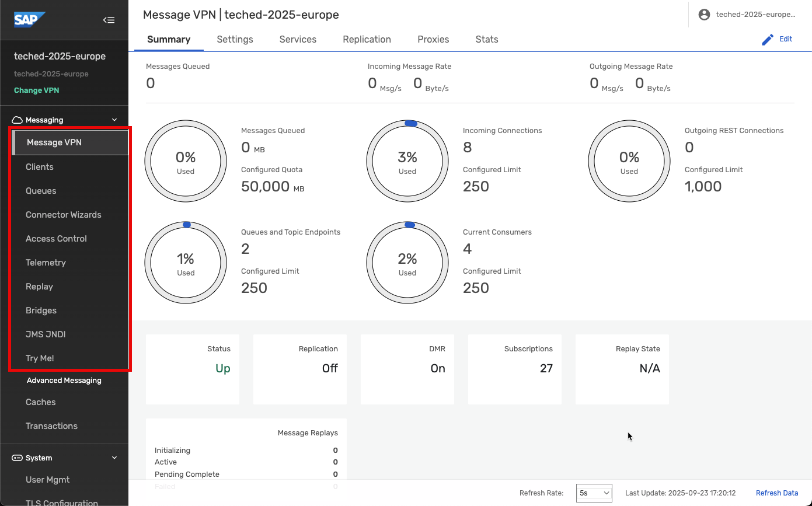  

## Exercise 1.2 - Create first queue and subscribe to sales order topic in SAP Integration Suite, advanced event mesh (AEM)
After completing these steps, you will have created the first queue subscribed to the sales order topic published from the SAP S/4HANA Cloud System in AEM.

1. Go back to the original AEM tab in your browser and click on **Cluster Manager** on the left.
   
2. In the **Cluster Manager: Services** screen, click on the **teched-2025-europe** tile.

	**HINT:** If you cannot see the tile, uncheck the **"Only show my services"** checkbox.

	  

3. Switch to the **Manage** tab, and click on the **Queues** link button.

	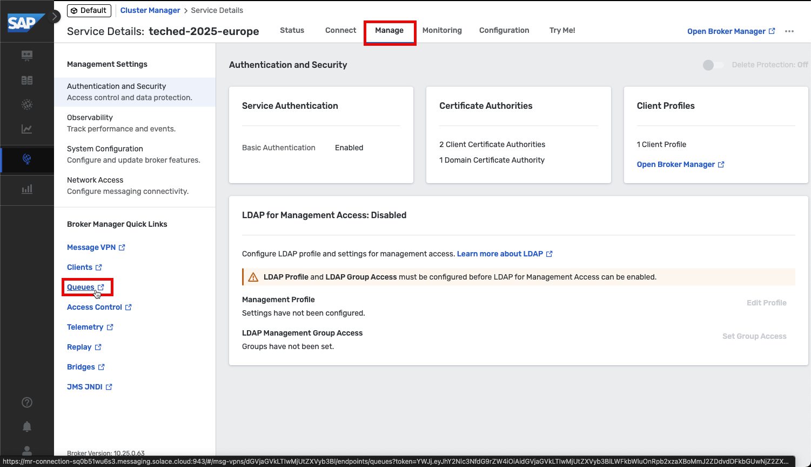     

4. A new browser tab or window will open, listing all the available Queues.
   <br>As mentioned earlier, each participant needs to create 2 queues and subscribe to the relevant topic.
   <br>In this exercise, we will create the first queue and subscribe to the given topic:
   
    - Queue Name: <b>IN162-***_Sales_Order</b> *(replace *** with the participant number that is assigned to you)*
   		- Topic Subscription: **"sap/teched/2025/ce/sap/s4/beh/salesorder/v1/SalesOrder/Created/v1"**

   Click the **+ Queue** button on the top right to create a queue.
   
	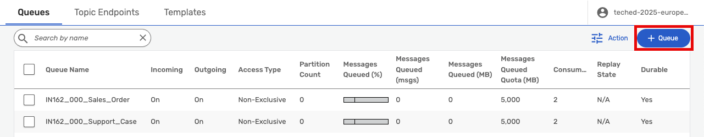        

5. In the pop up, enter the queue name: <b>IN162-***_Sales_Order</b> *(replace *** with the participant number that is assigned to you)* and click on the **Create** button.

	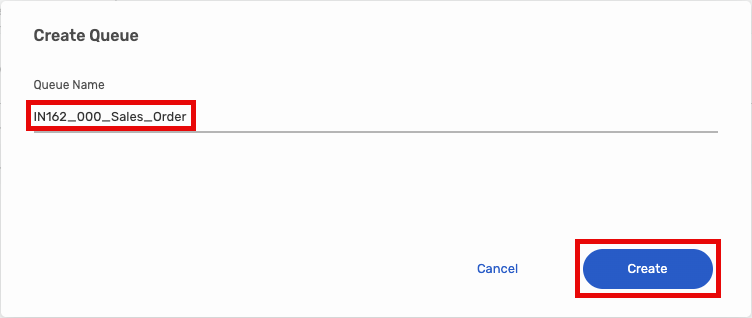

6. On the next screen, change the **Access Type** to **Non-Exclusive**, as this session does not require message order and exactly-once delivery. Leave the remaining configurations at their default settings, and click on the **Apply** button.
	> Note:
 	> <br>**Non-exclusive queue** → multiple consumers, parallel processing, no EOIO guarantee.
	> <br>**Exclusive queue** → single consumer, preserves EOIO (message order and exactly-once delivery).
	
	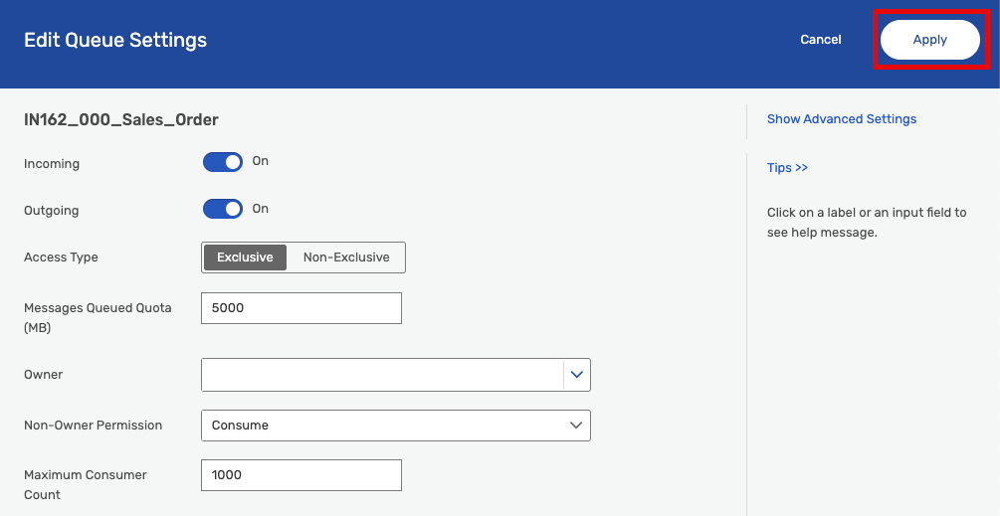       

7. Select and open the queue that you have just created i.e., <b>IN162-***_Sales_Order</b> *(replace *** with the participant number that is assigned to you)*
   
   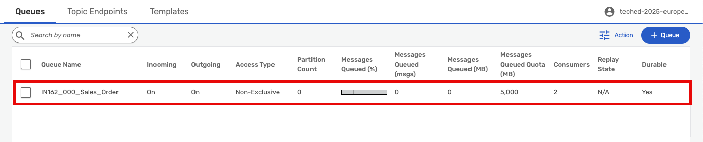
   
8. Switch to the **Subscriptions** tab and click on the **+ Subscription** button on the top right area to create a new topic subscription.

	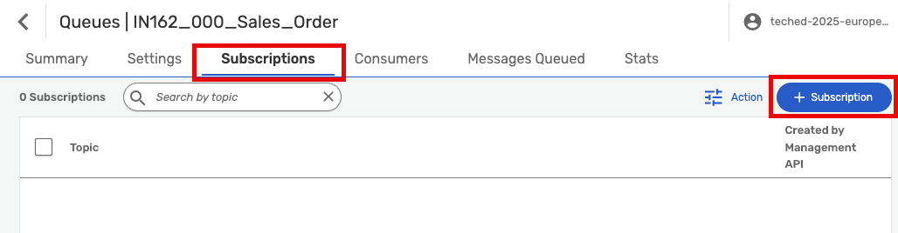

9. In the pop up, enter the topic: **"sap/teched/2025/ce/sap/s4/beh/salesorder/v1/SalesOrder/Created/v1"** and click on the **Create** button.

   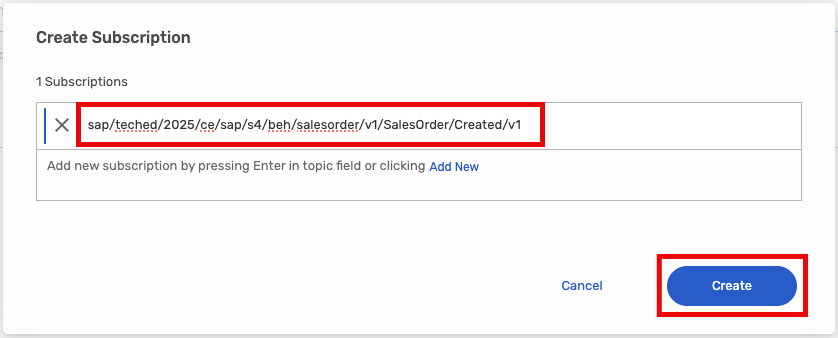

10. Check whether your queue subscription has been created.

	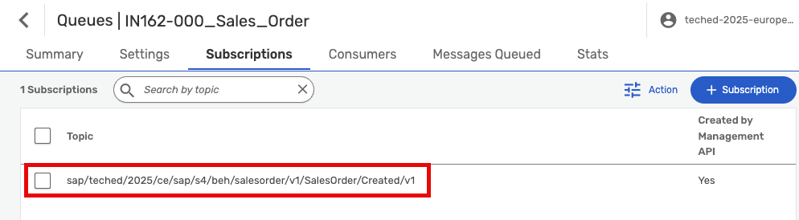


## Exercise 1.3 - Create second queue and subscribe to support case topic in SAP Integration Suite, advanced event mesh (AEM)
After completing these steps, you will have created the second queue subscribed to the support case topic published from the SAP Service Cloud Version 2 System in AEM.

1. Navigate back to Queues.

   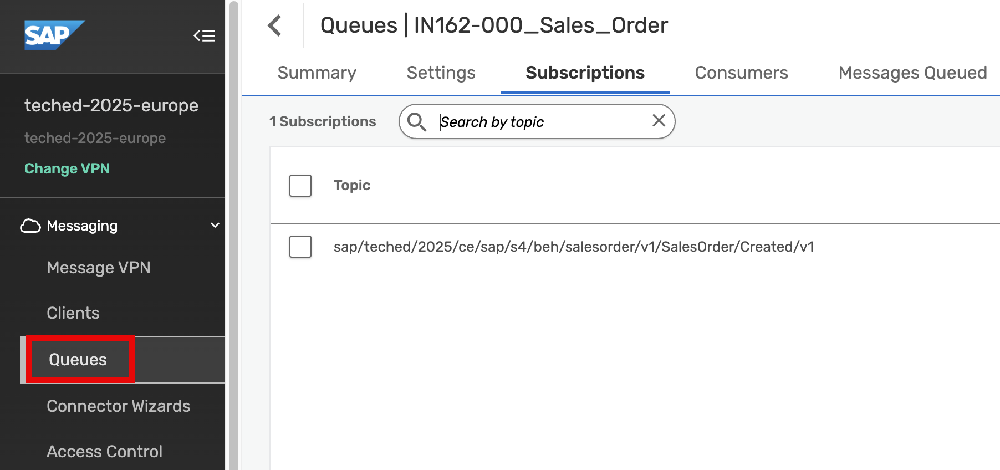 

2. In this exercise, we will create the second queue and subscribe to the given topic:
   
	- Queue Name: <b>IN162-***_Support_Case</b> *(replace *** with the participant number that is assigned to you)*
   		- Topic Subscription: **"sap/teched/2025/servicecloud/supportcase/created"**
  	
	Click the **+ Queue** button on the top right to create a queue.
   
	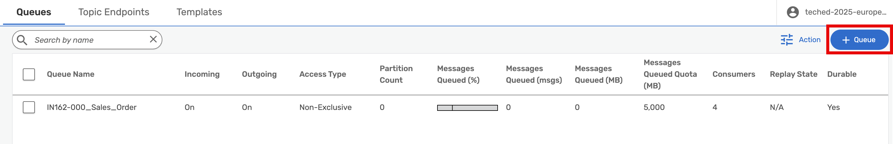

3. In the pop up, enter the queue name: <b>IN162-***_Support_Case</b> *(replace *** with the participant number that is assigned to you)* and click on the **Create** button.

	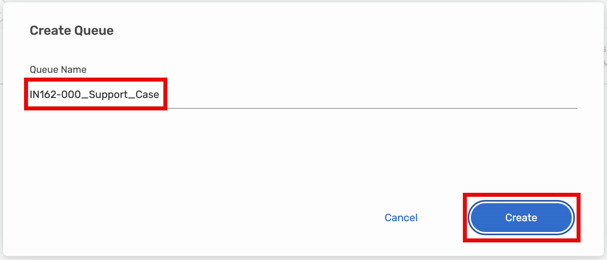

4. On the next screen, change the **Access Type** to **Non-Exclusive**, as this session does not require message order and exactly-once delivery. Leave the remaining configurations at their default settings, and click on the **Apply** button.
	> Note:
 	> <br>**Non-exclusive queue** → multiple consumers, parallel processing, no EOIO guarantee.
	> <br>**Exclusive queue** → single consumer, preserves EOIO (message order and exactly-once delivery).

	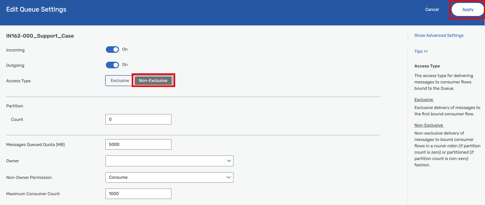       

5. Select and open the queue that you have just created i.e., <b>IN162-***_Support_Case</b> *(replace *** with the participant number that is assigned to you)*
   
   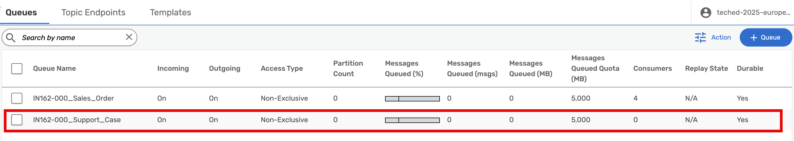
   
6. Switch to the **Subscriptions** tab and click on the **+ Subscription** button on the top right area to create a new topic subscription.

   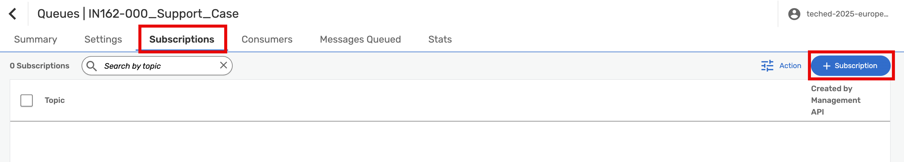

7. In the pop up, enter the topic: **"sap/teched/2025/servicecloud/supportcase/created"** and click on the **Create** button.

   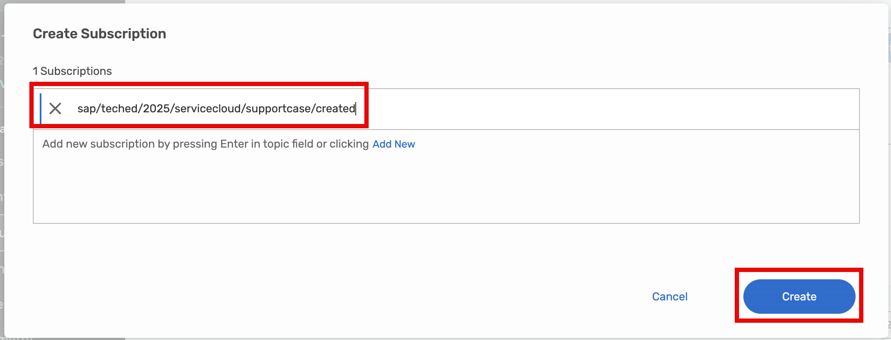

8. Check whether your queue subscription has been created.

   

9. There are now two queues created for your participant number.

	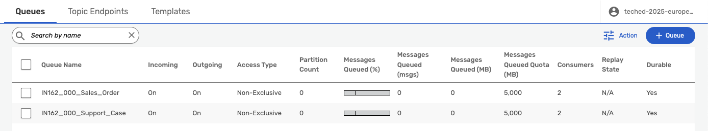 


## Exercise 1.4 - Send an event from the Try Me! tool to your Topic

1. Switch to the **"Try Me!"** Section in the menu on the left.

2. Press the **"expand" > Icon** to show the connection details. Please note, that the properties have to be adjusted else the connection will not work. We will update them in the next steps.
	
 	 

3. Keep your current browser tab open and **go back to the other/main tab** and click on the **"Connect"** tab. Select **View by "Protocol"**.

	 

4. Open the **"Solace Web Messaging"** entry and select **"Solace JavaScript API"**. Now the section on the right shows you the connection details.

5.  Copy these details into the relevant fields of the "**Try Me!**" opened in step 2 and overwrite the existing values.
   
	 

6. Press **"Connect"** button.

>[!Important] 
>If your browser asks to select a certificate for authentication, press **"Cancel"** otherwise the connection will fail! If you accidentially clicked on a certificate, please restart your browser to show the dialog again.

  

7. Choose **"Topic"** and provide the name of the topic subscribed in step 4 of previous exercise: user**XXX**/businesspartner/change  (replace **XXX** with your user number).

8. Change "Deliver Mode" to **"Persistent** and add the following "**Message Content**":
	```json
	{
		"specversion": "1.0",
		"type": "aif.businesspartner.change",
		"source": "S4H/100",
		"datacontenttype": "application/json",
		"id": "iopoR}Qa7k{IeB7xyLljsm",
		"time": "2024-07-23T15:09:31Z",
		"data": {
			"BusinessPartner": "A10",
			"LastName": "John",
			"FirstName": "Doe",
			"Country": "DE",
			"City": "Walldorf",
			"PostCode": "69190",
			"Street": "Dietmar-Hopp-Allee",
			"HouseNumber": "16"
		}
	}
	
	```

9. Click **"Publish"** to send your message to the topic.

	  

10. You should see 1 message got published.

	  

11. Switch back to the tab **"Queues"** and click on your queue.

	  

12. You should see 1 Message got Queued.

	  

	You have sent a message to a topic, and via the subscription this message has been persisted in your queue.

13. You can leave it like this or you can play the same game a little longer: go back to the Try Me! tool and just click publish, and see in the other tab how the count of messages gets increased (don't forget to refresh the page).

## Summary

You have now created a queue in SAP Integration Suite, advanced event mesh and have subscribed to events via a topic. You have sent events to this topic using the Try me! tool.

Please continue with [Exercise 2](../ex2/README.md)
