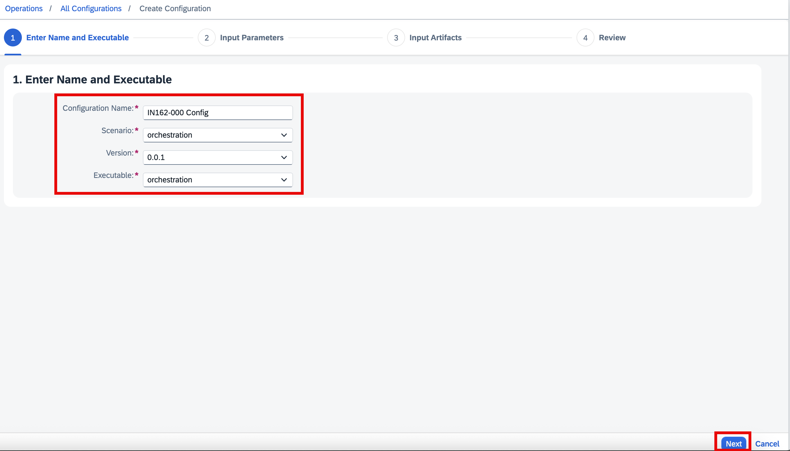
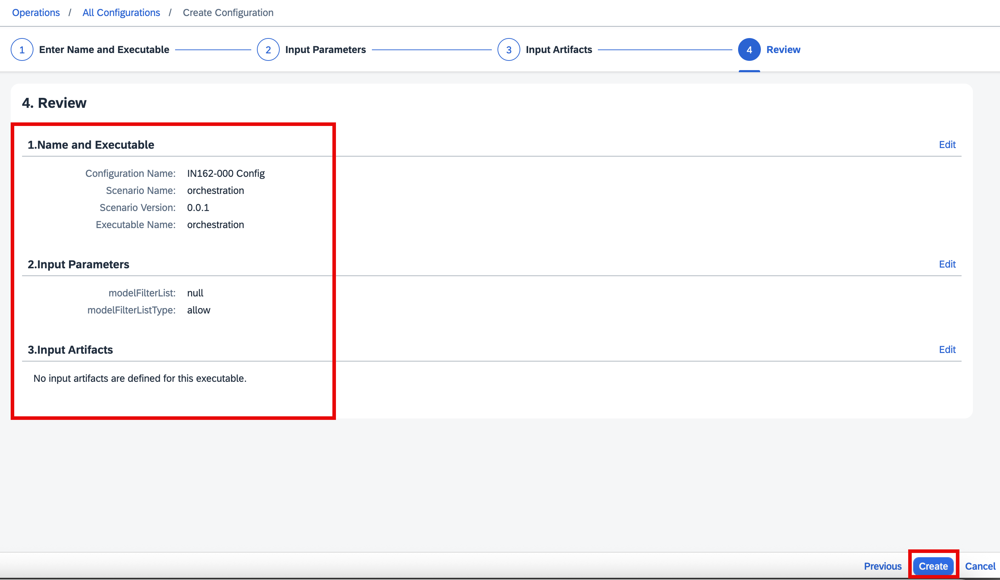

# Exercise 2 - Expose Embedding and Summarization Models as an API Using Gen AI Hub (AI Core)

In this exercise, you will create configuration and orchestration deployments in SAP Generative AI Hub with AI Core. The Orchestration Deployment URL will then be used to generate embeddings and summarize talking points derived from recent sales orders and support tickets for a customer.

### Conceptual Overview and Key Concepts
1.	A Resource Group in SAP AI Launchpad is like a project folder that holds and separates all your AI assets (models, configurations, data, etc.) for a specific team or a use case.
2.	The Executable is the pre-built SAP template that handles all the technical complexity of connecting your application to external LLMs like Azure, OpenAI or AWS Bedrock.
3.	The Configuration is your specific recipe card that links the generic executable template to a particular LLM (like 'GPT-4') and sets its parameters (like Temperature) to control its behaviour
4.	The Deployment is the final step that flips the power switch on your LLM configuration, turning it into a live service with a unique web address (URL) that SAP applications can use. In this case, it will be called by the integration flows in the Cloud Integration capability of SAP Integration Suite.

## Exercise 2.1 Log on to SAP AI Launchpad and create configuration  
1.	Log on to [SAP AI Launchpad](https://in162-ntn259xc.ai-launchpad.prod.eu-central-1.aws.ai-prod.cloud.sap/) tenant.
   
      > Note: The system login screen may not appear if you are already authenticated, as other systems connected to the same SAP Identity Authentication Service (IAS) tenant can trigger automatic login.

      If the login page appears, log on using the user ID and password provided by the instructors.

  	   

2. Each team has been assigned a resource group according to the assigned participant number.
    Verify that the resource group <b>IN162-0**</b> *(replace ** with the participant number that is assigned to you)* is visible in the SAP AI Launchpad.
    Select the available resource group to enable the menu items in the left pane: **Generative AI Hub**, **SAP AI Core Administration** and **ML Operations**.

   > Note: If your resource group is missing or does not match your participant number, contact the instructor.

   

   
3. From the left menu, select **ML Operations -> Configuration**, and then click **Create** button.

   

4. Provide the following details under **Enter Name and Executable** wizard step, and then click **Next** button.
    a.	Enter Configuration Name as <b>IN162-0** Config</b> *(replace ** with the participant number that is assigned to you)*
    b.	Choose Scenario as **orchestration**
    c.	Choose the Version as **0.0.1**
    d.	Choose the Executable as **orchestration**

   

5.	Keep the default values in the **Input Parameters** wizard step, and then click **Next** button.

  	
 
6.	No need to provide any detail in the **Input Artifacts** wizard step, and directlt click **Review** button.

  	

7.	Finally, **review** the provided details, and then click the **Create** button.

  	

## Exercise 2.2 Create Deployment
1.	Open Configuration details **(ML Operations->Configuration->IN162-0XX Config)**
2.	Click Create Deployment button (top right)
  

3.	Provide Details: Create Deployment -> **Select Scenario**
  i.	Select Orchestration
  

4.	Provide Details: Create Deployment -> **Select Executable**
     i.	Select orchestration and click next
  

5.	Provide Details: Create Deployment-> **Select Configuration**
  i.	Select the Configuration (IN162-0XX Config) you created earlier
  ii. Click next
  

6.	Provide Details: Create Deployment -> **Duration**
     i.	Select standard and click next
  

7.	Provide Details: Create Deployment -> **Review**
     i.	Click Create

8.	Wait for the Deployment to start Running (it takes a minutes to start the deployment so we can start with other activities in this handson exercise)
     i.	**Come back on this screen** once the Deployment status is “running”
  	  ii.	**We would need the deployment id and URL** in our Integration Suite

  

## Summary

You've now a group specific deployment URL and deployment ID. This url and id will be used in Integration flow to automatically trigger data ingestion by creating embeddings and inserting the data in HANA vector DB. These details will be also used while preparing the latest report for customer.

Continue to - [Exercise 3](../ex3/README.md)
