# Exercise 2 - Expose Embedding and Summarization Models as an API Using Gen AI Hub (AI Core)

In this exercise, you will create configuration and orchestration deployments in SAP Generative AI Hub with AI Core. The Orchestration Deployment URL will then be used to generate embeddings and summarize talking points derived from recent sales orders and support tickets for a customer.

### Key Concepts
1.	A **Resource Group** in SAP AI Launchpad is like a project folder that holds and separates all your AI assets (models, configurations, data, etc.) for a specific team or a use case.
2.	The **Executable** is the pre-built SAP template that handles all the technical complexity of connecting your application to external LLMs like Azure, OpenAI or AWS Bedrock.
3.	The **Configuration** is your specific recipe card that links the generic executable template to a particular LLM (like 'GPT-4') and sets its parameters (like Temperature) to control its behaviour
4.	The **Deployment** is the final step that flips the power switch on your LLM configuration, turning it into a live service with a unique web address (URL) that SAP applications can use. In this case, it will be called by the integration flows in the Cloud Integration capability of SAP Integration Suite.

## Exercise 2.1 - Log on to SAP AI Launchpad and Create Configuration 
After completing these steps, you will have created the configuration in SAP AI launchpad

1.	Log on to [SAP AI Launchpad](https://in162-ntn259xc.ai-launchpad.prod.eu-central-1.aws.ai-prod.cloud.sap/) tenant.
   
      > Note: The system login screen may not appear if you are already authenticated, as other systems connected to the same SAP Identity Authentication Service (IAS) tenant can trigger automatic login.

      If the login page appears, log in using the user ID and password provided by the instructors.

  	   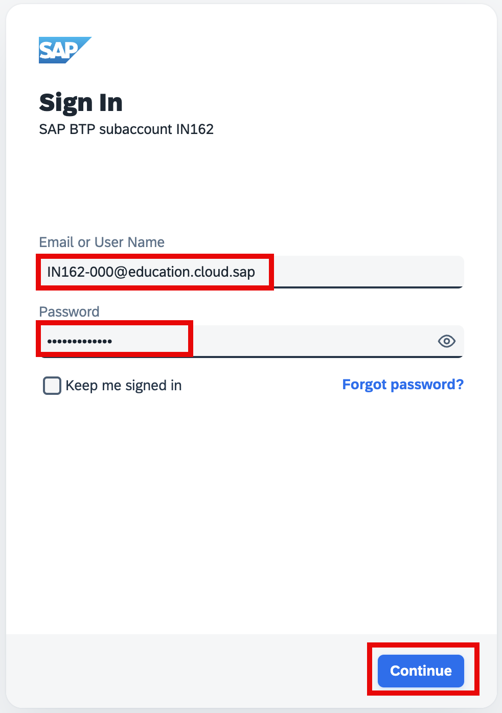

2. Each participant has been assigned a resource group according to her assigned participant number.
    Verify that the resource group <b>IN162-0**</b> *(replace ** with the participant number that is assigned to you)* is visible in the SAP AI Launchpad.
    Select the available resource group to enable the menu items in the left pane: **Generative AI Hub**, **SAP AI Core Administration**, and **ML Operations**.

   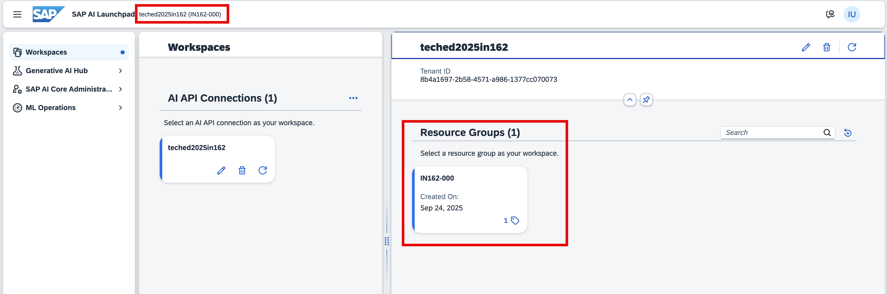

   > **Note**: Participants with the following numbers — `IN162-062`, `IN162-065`, `IN162-070`, `IN162-076`, `IN162-086`, `IN162-088`, or `IN162-093` — will be assigned to a different resource group. This is intentional.
   >
   > Other than these, if your resource group is missing, please get in touch with the instructor.

   
3. From the left menu, select **ML Operations -> Configuration**, and then click **Create** button.
   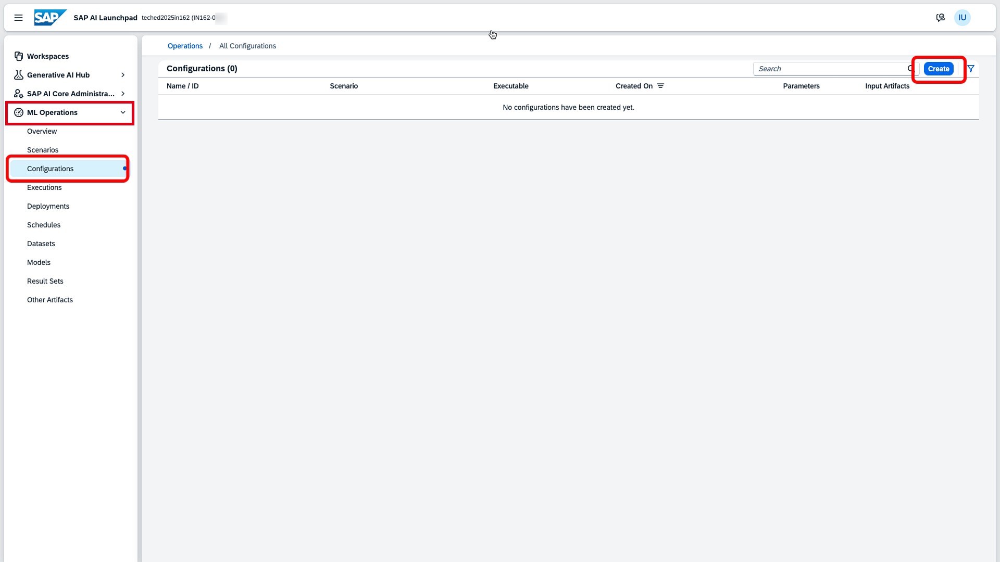

   > **Note**: If your participant number falls between **IN162-001** and **IN162-045**, you may see an existing Configuration. This occurs because these participant numbers are also being used simultaneously at another location. You can safely disregard the existing entry and **proceed to create a new one**. 

   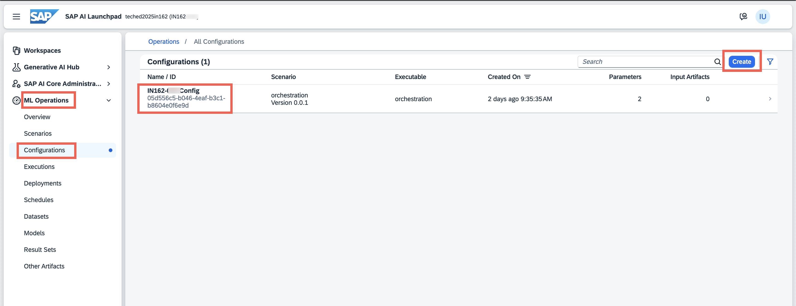

4. Provide the following details under **Enter Name and Executable** wizard step, and then click **Next** button.
    a.	Enter Configuration Name as <b>IN162-0** ASUG Config</b> *(replace ** with the participant number that is assigned to you)*
    b.	Choose Scenario as **orchestration**
    c.	Choose the Version as **0.0.1**
    d.	Choose the Executable as **orchestration**

   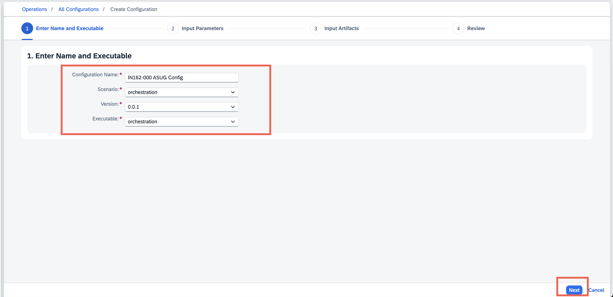

5.	Keep the default values in the **Input Parameters** wizard step, and then click **Next** button.

  	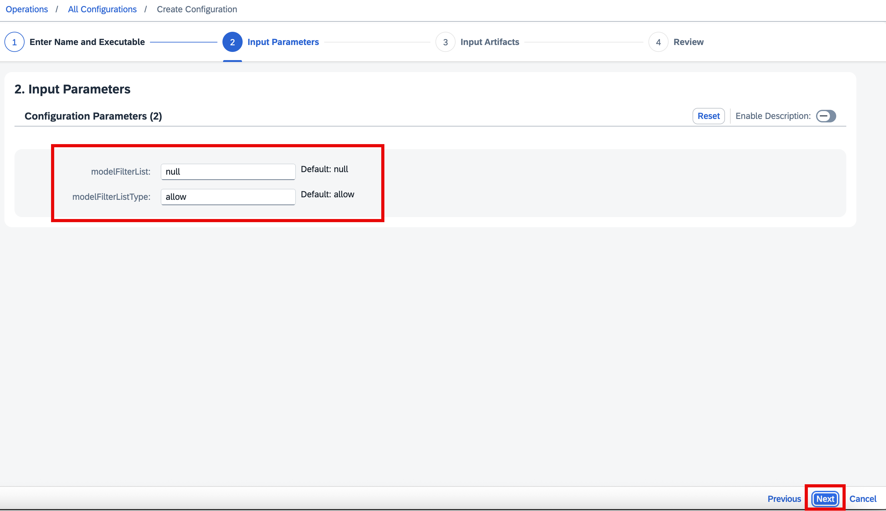
 
6.	No need to provide any detail in the **Input Artifacts** wizard step, and directly click **Review** button.

  	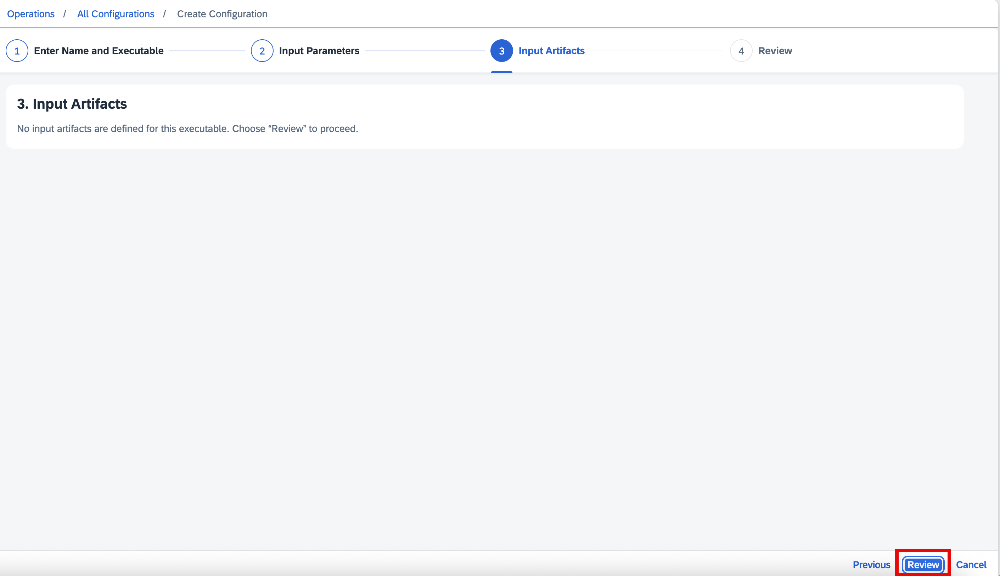

7.	**Review** the provided details, and then click the **Create** button.

  	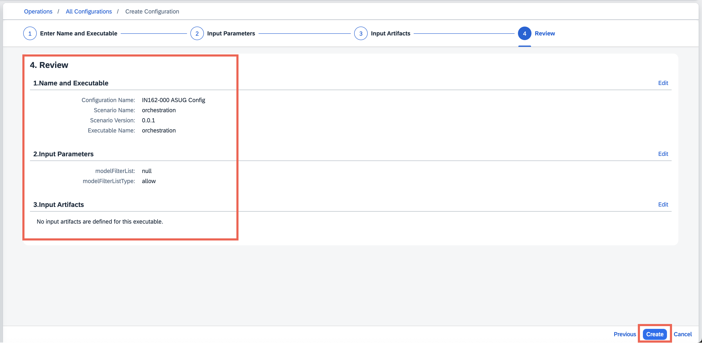

8. This is the final step, where the configuration is created and displayed on the screen.

   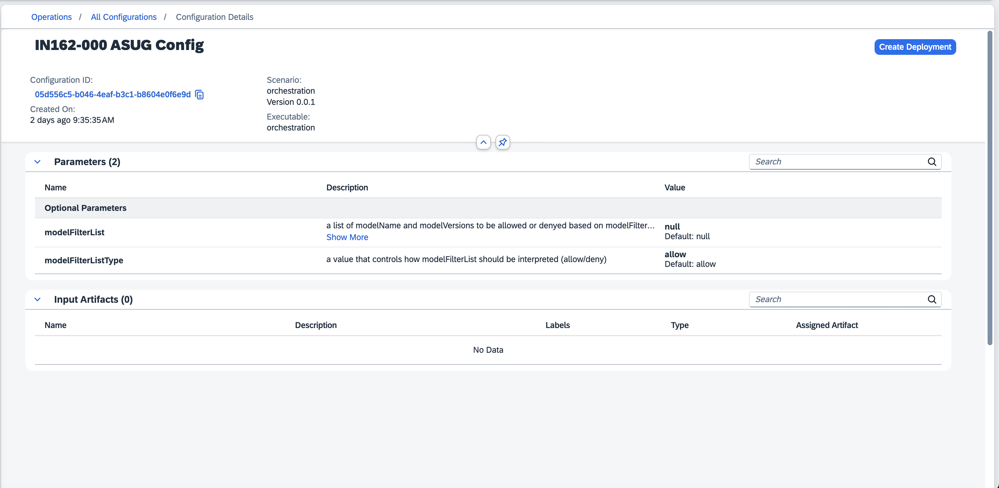

## Exercise 2.2 - Create Deployment
After completing these steps, your deployment will be created and running in SAP AI Launchpad.

1.	Click the **Create Deployment** button in the top-right corner to create the deployment.

  	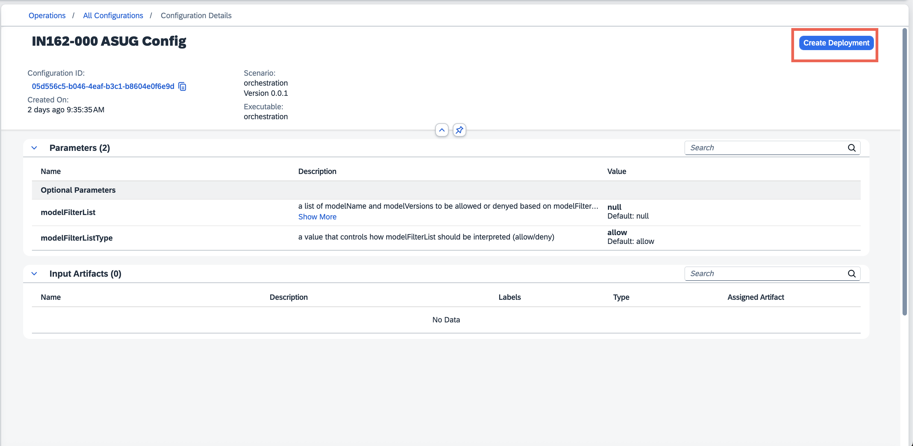

2.	The wizard will automatically open **Step 4: Duration**. Keep the default selection (**Standard**), and then click the **Review** button.

  	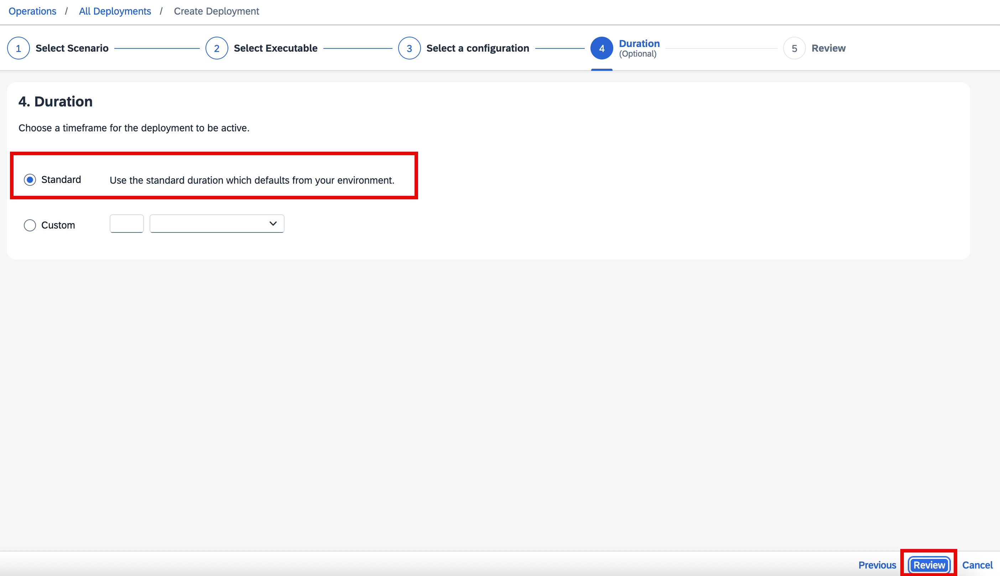

3.	**Review** the provided details, and then click the **Create** button.

  	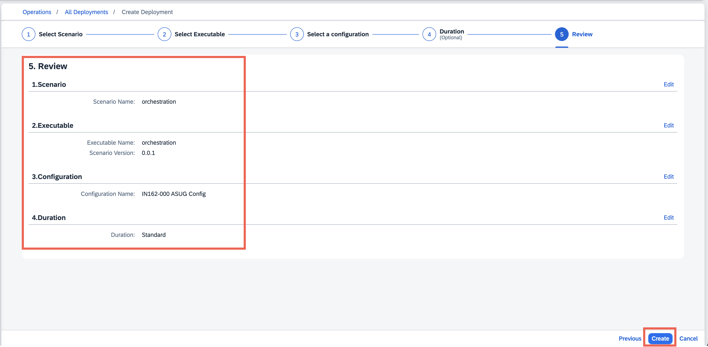

4.	Wait for the deployment to start running. This may take a few minutes, so you can proceed with the next exercise in this hands-on session.
   Once the deployment status shows **RUNNING**, copy the Deployment ID and URL. Click on the **Refresh** Button in case you do not see the URL. You’ll need them in the next exercise when working with integration flows in the Cloud Integration capability of SAP Integration Suite.
   
>[!TIP]
>Use only the copy button to copy the URL correctly. Right-clicking on the URL to copy it will result in an incorrect value!

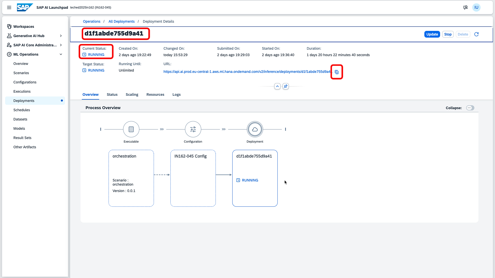
   
   > **Note:** In case the deployment does not show the **RUNNING** status even after some minutes, you can use the following Deployment ID and URL to be used in the integration flows of the Cloud Integration: 
   >   Deployment ID: **db1ce5ede0291ce0** 
   >  Deployment URL: **https://api.ai.prod.eu-central-1.aws.ml.hana.ondemand.com/v2/inference/deployments/db1ce5ede0291ce0**

## Summary

At the end of the second exercise, you created your exclusive configuration and orchestration deployments. The Deployment ID and URL can now be used in an integration flow to generate embeddings and insert them into the SAP HANA Cloud vector database. These details will also be used to summarize key talking points from recent sales orders and support tickets in the Joule-Powered Customer Success Digital Assistant.

Continue to - [Exercise 3](../ex3/README.md)
