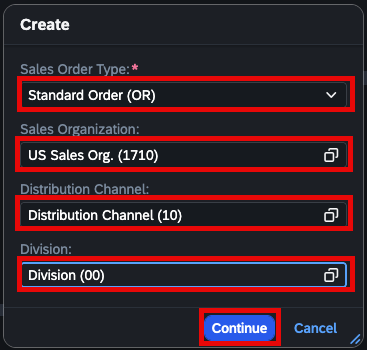
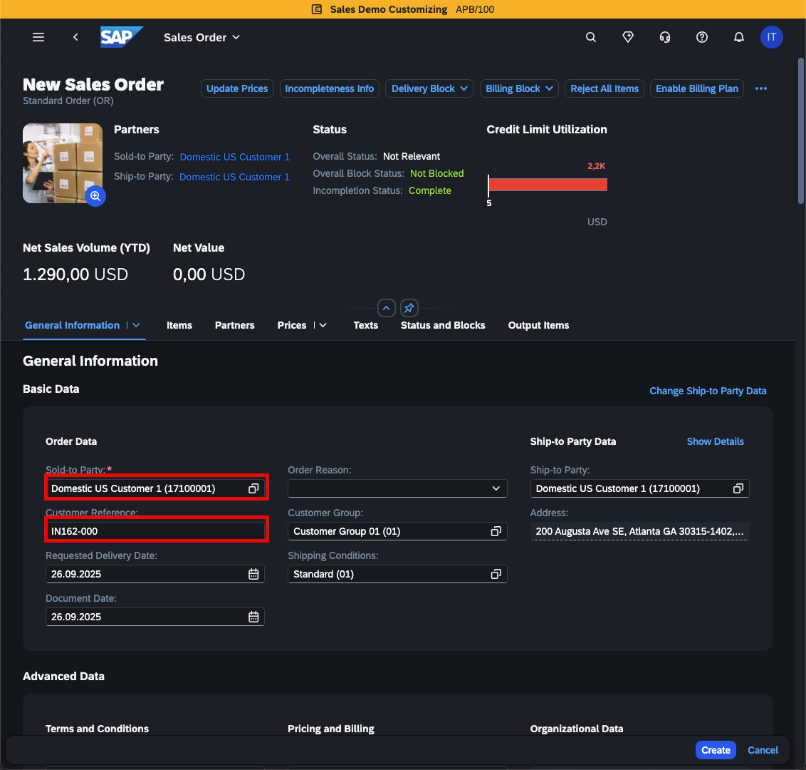
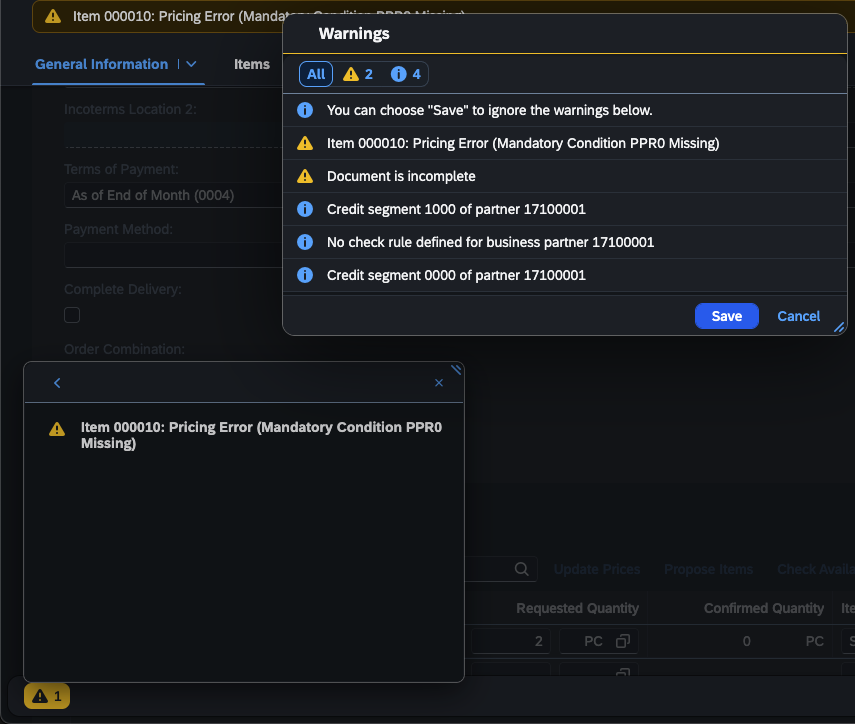
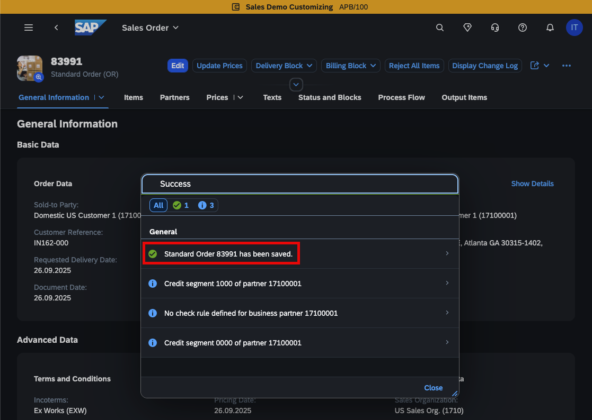
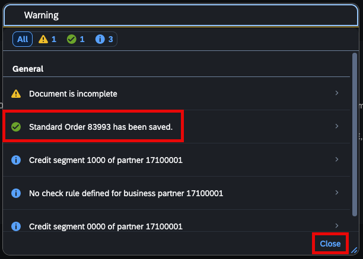

# Exercise 3 - Integration Suite – Iflow S4Hana Sales Order to embedding model to SAP Hana Vector DB

In this exercise, we will configure an IFlow to receive a notification event upon the creation of a Sales Order in S/4HANA. Using the Sales Order ID, we will then retrieve the complete Sales Order details from the S/4HANA system. These details will be transformed into vector embeddings through the `text-embedding-3-small` model via SAP Generative Hub’s REST APIs. The resulting embeddings will be stored in a connected HANA Vector Database, enabling efficient retrieval and text summarization when queried through the Joule assistant.

## Exercise 3.1 - Create a package and an IFlow in your designated tenant

1. Log into your assigned Integration Suite tenant and create a new Package from the 'Integration and APIs' sub-menu within the 'Design' menu. 
    Name your package as follows : 'IN162_`XX`_Solution_Package' (replace `XX` with your assgined user identifier)
 

2. After the package is created, go to the 'Artifacts' tab, 'Edit' and create a new 'Integration Flow'.
 

3. In the create dialog, name your integration flow as : 'IN162_`XX` Sales Order Event to Hana Vector DB for AI Grounding' (replace `XX` with your assgined user identifier). 
    Open the IFLow in the editor.
 

## Exercise 3.2 - Create a new Sales Order in S/4Hana Cloud system

1. Log into [SAP S/4Hana Cloud system](https://my427029.s4hana.cloud.sap/ui)\
   Usermame/Password: provided by the moderator

2. Find on the displayed landingpage the **Apps** section. Under **Recommended** you will find the **Create Sales Orders** app.\
   Click the tile to start the Sales Order creation wizard.   

   

3. Provide the following details to create the new Sales Order:

   

   - Sales Order Type: **Standard Order (OR)**
   - Sales Organization: **US Sales Org. (1710)**
   - Distribution Channel: **Distribution Channel (10)**
   - Division: **Division (00)**

   Finally click on **Continue**.

   > [!TIP]
   > You can use the value help for each field to select the desired entry.

4. You need to fill further details for the Sales Order to be created

   

   - Sold-to Party: **Domestic US Customer 1 (17100001)**
   - Customer Reference: **IN162-`XXX`** (replace `XXX` with your assgined group identifier)

   > [!IMPORTANT]
   > All participants are using the same **Sold-to Party**. Make sure to fill the **Customer Reference** with your proper group identifier. This will be used to associate the Sales Order to each participant.

3. Scroll further down to the **Items** section\
   You can add as many items to your order as you would like.

   

   - Select any of the available products from the list. A good starting point are the products starting with `FG`. :wink:
   - Provide the amount that you would like to order and hit `ENTER` key to complete the entry.
   - A new emtpy entry will appear.
   - Once finished click on the **Create** button.

   > [!NOTE]
   > Depending on the products that you selected, you might see a warning message.
   > Most of the time you can just ignore this and click on the **Save** button. 
   > 

4. The new Sales Order has been successfully created in the system. A new event has been published in the background to AEM. 

   

   > [!NOTE]
   > If you have seen warning message in the previous step, you'll also see a warning in the summary.
   > Still, your Sales Order should have been successfully created. Click on the **Close** button. 
   > 

## Exercise 3.3 - Monitor IFlow execution