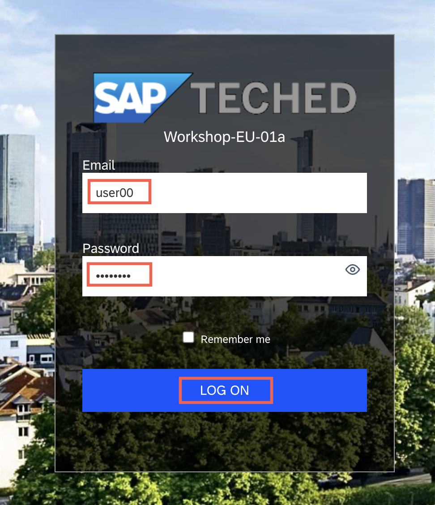
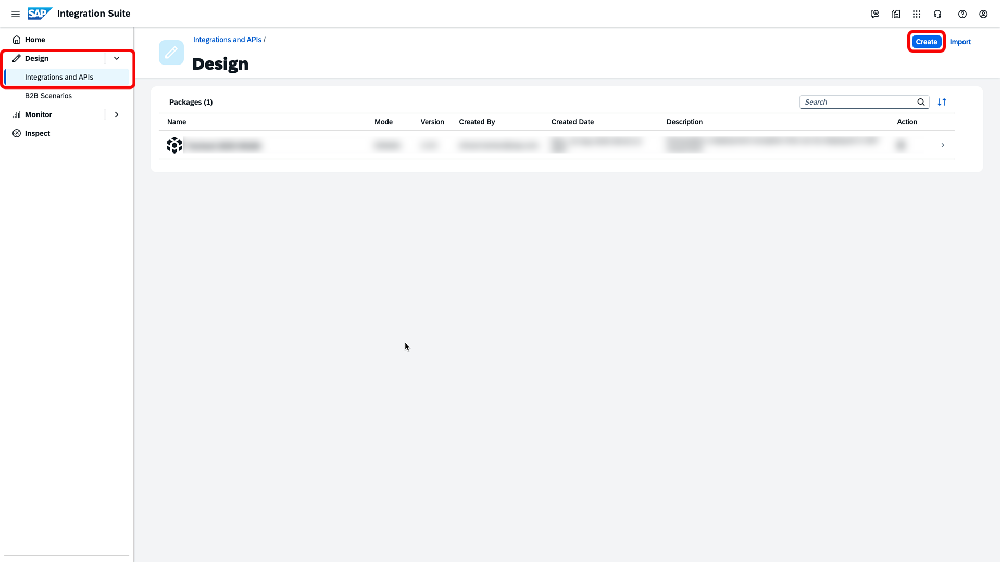
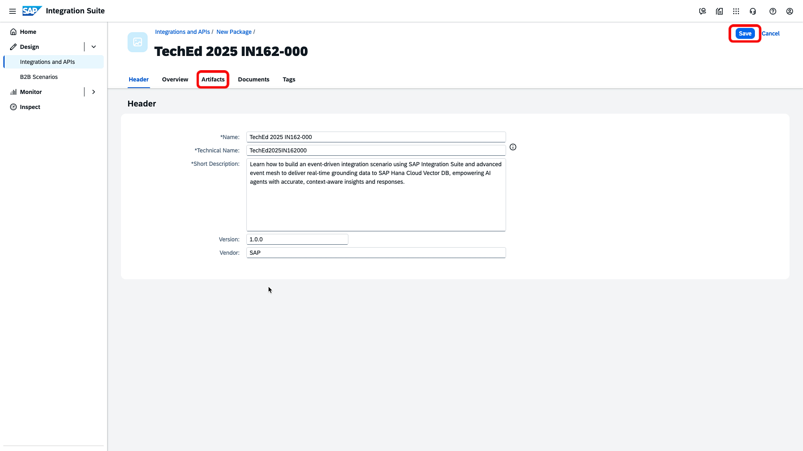
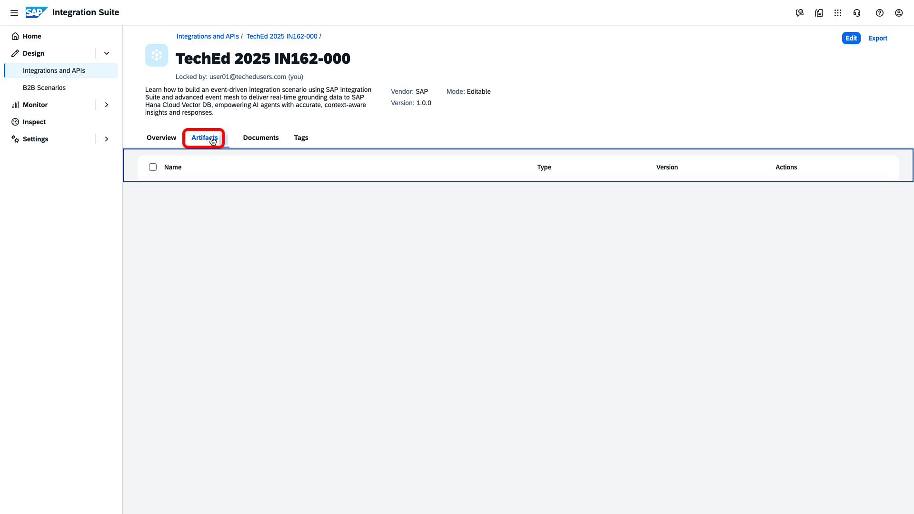

# Exercise 3 - Create an Integration Flow for S/4HANA Sales Order to embedding model to SAP HANA Vector DB in SAP Integration Suite
In this exercise, we will put together an integration flow to receive the notification event that is emitted upon the [creation](../ex5/README.md) of a Sales Order in **SAP S/4HANA Cloud** system using an AEM Adapter. Using the Sales Order ID, we will then retrieve the complete Sales Order details from SAP S/4HANA Cloud system. These details will be transformed into text embeddings through the `text-embedding-3-small` model via SAP Generative Hub’s REST APIs, as we accomplished in the [previous](../ex2/README.md) exercise. 

The resulting embeddings will be stored in a connected SAP HANA Vector Database, enabling efficient retrieval and text summarization when queried through the Joule assistant.

For your convenience, this exercise is offered in two formats:

- **Recommended Approach** ([Exercise 3.2](./ex3_2_details.md)): Copy a fully prepared IFlow, applying only minimal configuration before deployment. This option is ideal for participants who have limited time or prefer to work with pre-built content.
- **Alternate Approach** ([Exercise 3.1](./ex3_1_details.md)): Build the IFlow from scratch by following step-by-step instructions. This method provides a deeper hands-on experience and a better understanding of the flow design.

> [!TIP] 
> Even if you follow the recommended approach, it is strongly advised to review **Exercise 3.1** in detail to gain a comprehensive understanding of its functionality.

Irrespective of the approach you choose, let's begin the exercise by logging into your designated tenant and creating a package to get started.

## Step 1 - Log into your designated Integration Suite tenant

1. Identify your assigned SAP Integration Suite tenant to log into. Note that we are running this workshop across multiple events/geographies. So, it is important that you log into the right tenant. Make sure that the Integration Suite tenant you are logging into has  `us10`or `us20`, or `us30` segments as part of the URL host.  

    Make sure you refer to [this](../../README.md#system-url-and-login-information) section to identify your tenant based on your assigned participant identifier. 
2. Log in to the SAP Integration Suite tenant using the user ID and password that has been provided by the instructors.

   

> [!NOTE]
> Pay attention that we are using different user and password only for SAP Integration Suite tenant. Also use the User`**` pattern to log into the SAP Integration Suite tenant and not the IN162-`***` pattern as you have used in the previous exercise.

## Step 2 - Create a package in your SAP Integration Suite tenant

1. Now that you are logged into the tenant,  '**Create**' a new Package from the '**Integration and APIs'** sub-menu under the '**Design**' menu (Click on the 'hamburger' icon on the left to launch the menu, if it's hidden).
 

2. Enter the following details to describe the package and '**Save**' it. After the Package is successfully created, go to the '**Artifacts**' tab.
    | Field | Value |
    | ----- | ----- |
    | Name | TechEd 2025 IN162-`000` (replace `000` with your assigned user identifier) |
    | Short Description | Learn how to build an event-driven integration scenario using SAP Integration Suite and advanced event mesh to deliver real-time grounding data to SAP Hana Cloud Vector DB, empowering AI agents with accurate, context-aware insights and responses. |
    | Version | 1.0.0|
    | Vendor | SAP |

     

3. Your Integration Package has been created, and now, at this point, you are ready to either create an IFlow from scratch or copy / import an existing one. 
     

    At this juncture, follow either [Exercise 3.2](./ex3_2_details.md) (recommended - easy and quick) or [Exercise 3.1](./ex3_1_details.md) (expert grade - thorough and long).

