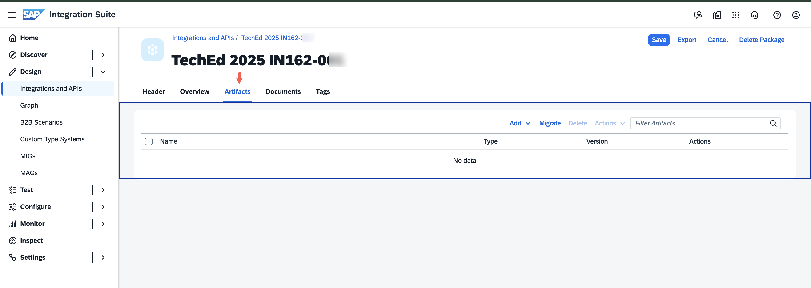

# Exercise 3 - Integration Suite – IFlow S/4HANA Sales Order to embedding model to SAP HANA Vector DB

In this exercise, we will put together an IFlow to receive the notification event that is emitted upon the [creation](../ex5/README.md) of a Sales Order in S/4HANA with an AEM Adapter. Using the Sales Order ID, we will then retrieve the complete Sales Order details from the S/4HANA system. These details will be transformed into text embeddings through the `text-embedding-3-small` model via SAP Generative Hub’s REST APIs, as we accomplished in the [previous](../ex2/README.md) exercise. 

The resulting embeddings will be stored in a connected SAP HANA Vector Database, enabling efficient retrieval and text summarization when queried through the Joule assistant.

For your convenience, this exercise is offered in two formats:

- Recommended Approach ([Exercise 3.1](./ex3_1_details.md)): Build the IFlow from scratch by following step-by-step instructions. This method provides a deeper hands-on experience and a better understanding of the flow design.
- Alternate Approach ([Exercise 3.2](./ex3_2_details.md)): Skip the build steps and instead copy a fully prepared IFlow, applying only minimal configuration before deployment. This option is ideal for participants who have limited time or prefer to work with pre-built content.

Irrespective of the approach you choose, let's begin the exercise by logging into your designated tenant and creating a package to get started.

## Step 1 - Log into your designated Integration Suite tenant

1. Log on to [SAP Integration Suite](https://workshop-eu-01a.integrationsuite-cpi033.cfapps.eu10-005.hana.ondemand.com/shell/design) tenant using the user ID and password that is already provided by the instructors.
      
     > **Note**: Pay attention that we are using the user`**` pattern to log into the Integration Suite tenant and not the IN162-`***` pattern as you have used in the previous exercise. However, for the subsequent steps of the exercise, you will need to present your corresponding IN162-`***` as the unique user identifier.

## Step 2 - Create a package in your Integration Suite tenant

1. Now that you are logged into the tenant,  'Create' a new Package from the 'Integration and APIs' sub-menu under the 'Design' menu (Click on the 'hamburger' icon on the left to launch the menu, if it's hidden).
 

2. Enter the following details to describe the package.
    | Field | Value |
    | ----- | ----- |
    | Name | TechEd 2025 IN162-`000` (replace `000` with your assigned user identifier) |
    | Short Description | Learn how to build an event-driven integration scenario using SAP Integration Suite and advanced event mesh to deliver real-time grounding data to SAP Hana Cloud Vector DB, empowering AI agents with accurate, context-aware insights and responses. |
    | Version | 1.0.0|
    | Vendor | SAP |

     
After the Package is successfully created, go to the 'Artifacts' tab.

3. Your Integration Package has been created, and now at this point, you are ready to either create an IFlow from scratch or copy / import an existing one. 
     

    At this juncture, follow either [Exercise 3.1](./ex3_1_details.md) or [Exercise 3.2](./ex3_2_details.md).

