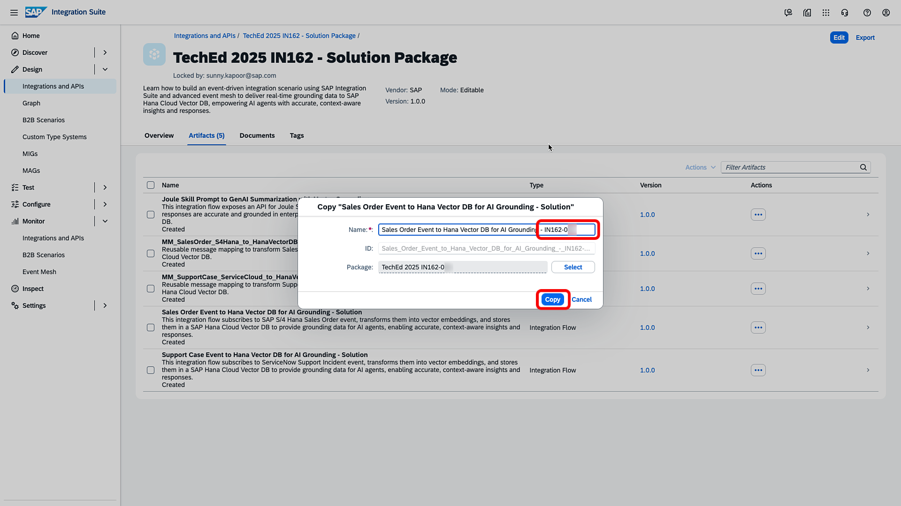

# Exercise 3.2 - Copy an existing IFlow to receive a Sales Order creation event, transform into embeddings, and persist to HANA Vector DB
Make sure you come to this exercise after completing [Exercise 3](./README.md).

In this exercise, instead of building an IFlow from scratch, we will copy a completed IFlow from the source package and configure the parameters that have been externalized for the participants.

> [!IMPORTANT]  
> Note that we will be accessing the main solution package in this exercise. Please don't change anything in the solution package in any way. 


## Step 1 - Copy the IFlow from the source Package 

1. Navigate to the 'Integration and APIs' section from the 'Design' tab of your Integration Suite tenant.
   
   Click on a Package titled 'TechEd 2025 IN162 - Solution Package
  
   <br>
   <br>
2. Navigate to the 'Artifacts' tab of this package, look for an Integration Flow titled 'Sales Order Event to Hana Vector DB for AI Grounding' and click on the '...' Action button to bring up the action menu and click on 'Copy'.

   <br>
   <br>
   
3. A copy dialog will pop open. **Do not** click on 'Copy' yet. Click on 'Select' to specify the target Package to copy this content into.

   <br>
   <br>
4. A package Selection dialog will open up. Select the target package as 'TechEd 2025 IN162-`000`. Note that we created this Package in the first segment of Exercise 3. 
> [!NOTE]
> Replace the `000` with your assigned user idenfifier.

   <br>
   <br>
   
5. Back in the 'Copy' dialog, title the Name of the IFlow as
   ```
   Sales Order Event to Hana Vector DB for AI Grounding - IN162-000
   ```
> [!NOTE]
> Replace the `000` with your assigned user idenfifier.
   After this, click on 'Copy'.
   <br>
   <br>
   
6. After the copy is successful, navigate to the copied package by clicking on the 'Navigate' button in the presented dialog.

   <br>
   <br>
## Step 2 - Configure the IFlow with your user settings 
Now that the IFlow has been copied, we will configure it with certain externalized parameters in the next few steps. 

1. Make sure you are in the target package (TechEd 2025 IN162-`000`). Go to the 'Artifact' tab. Select the 'Sales Order Event to Hana Vector DB for AI Grounding' IFlow, click on the '...' Action menu button, and click 'Configure'.
> [!NOTE]
> Replace the `000` with your assigned user idenfifier.

  <br>
   <br>
   
2. The configuration dialog will pop open. In the 'Sender' tab, enter 'IN162-`000`_Sales_Order' in the 'Queue Name' text box. 
> [!NOTE]
> Replace the `000` with your assigned user idenfifier.

  <br>
   <br>
3. Next, navigate to the 'Receiver' tab and enter the URL https://api.ai.prod.eu-central-1.aws.ml.hana.ondemand.com/v2/inference/deployments/your-deployment-id/v2/embeddings in the AI_Launchpad_URL textbox. 
> [!NOTE]
> Copy the deployment-id from Exercise 2 after you created the deployment

  <br>
   <br>
4. Move over to the 'More' tab and enter 'IN162-`000`' in the Assigned_Participant_ID text box. 
> [!NOTE]
> Replace the `000` with your assigned user idenfifier.

Click on 'Save' to save your configuration settings.

 <br>
   <br>
## Step 3 - Deploy the IFlow 
Now that the configuration is complete, we will move ahead and deploy the IFlow.

1. Click on 'Deploy' in the configuration dialog from the previous step. OR you can open editor to 'Deploy' the flow
   Select the default 'Cloud Integration' as the runtime profile to deploy the content into.

 <br>
   <br>
<br>
   <br>

2. A dialog will confirm the deploy action.

<br>
   <br>
3. A message toast will confirm the successful completion of the deployment step.

<br>
   <br>
4. The IFLow is in the 'starting' phase now. Click on the IFlow to bring up the model. After a minute or so, you should see the 'Runtime Status' change to 'Started'. This means that the IFlow is ready and listening for changes.

<br>
   <br>
## Step 4 - Study the sequence of steps in the IFlow 
It is highly recommended that you review the IFlow in detail to gain a broader understanding of its functionality. You can do so by navigating to [Exercise 3.1](./ex3_1_details.md) and inspecting the complete sequence.
<br>
   <br>
## Summary

This completes Exercise 3, Next proceed to [Exercise 4](../ex4/README.md), where we will achieve a similar flow to consume events emitted upon support case creation in SAP Service Cloud V2.
