# Exercise 3.2 - Copy an existing Integration Flow to receive a Sales Order creation event, transform into embeddings, and persist to HANA Vector DB
Make sure you come to this exercise after completing [Exercise 3](./README.md).

In this exercise, instead of building an integration flow from scratch, we will copy a completed integration flow from the solution package and configure the parameters that have been externalized for the participants.

> [!IMPORTANT]  
> Note that we will be accessing the main solution package in this exercise.\
> **Please don't change or delete anything in the solution package in any way.**

## Step 1 - Copy the Integration Flow from the Solution Package 

1. Navigate to the '**Integration and APIs**' section from the '**Design**' tab of your SAP Integration Suite tenant.
   
   Click on a Package titled '**TechEd 2025 IN162 - Solution Package**'

   

2. Navigate to the '**Artifacts**' tab of this package, look for an integration flow titled '**Sales Order Event to Hana Vector DB for AI Grounding - Solution**' and click on the '**...**' action button to bring up the action menu and click on '**Copy**'.

   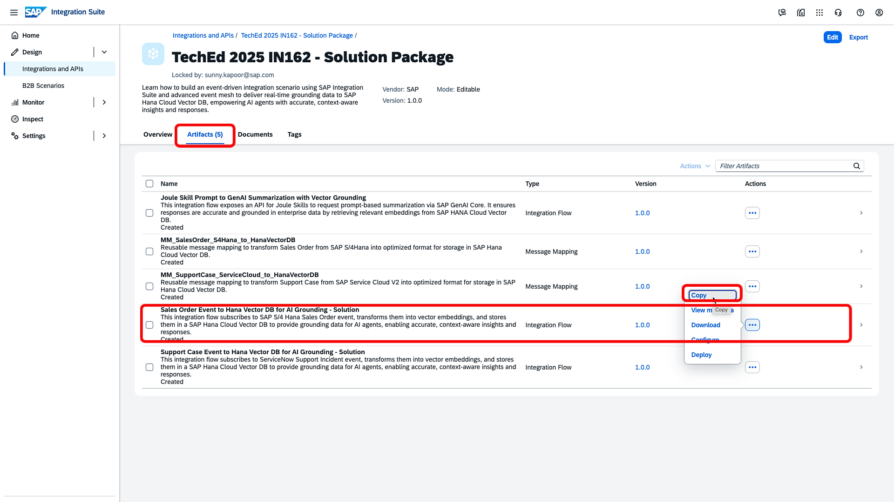
   
3. A copy dialog will pop open. **Do not** click on '**Copy**' yet. Change the name of the integration flow as **`Sales Order Event to Hana Vector DB for AI Grounding - IN162-0xx`**, replace the **`xx`** with your assigned user identifier.

   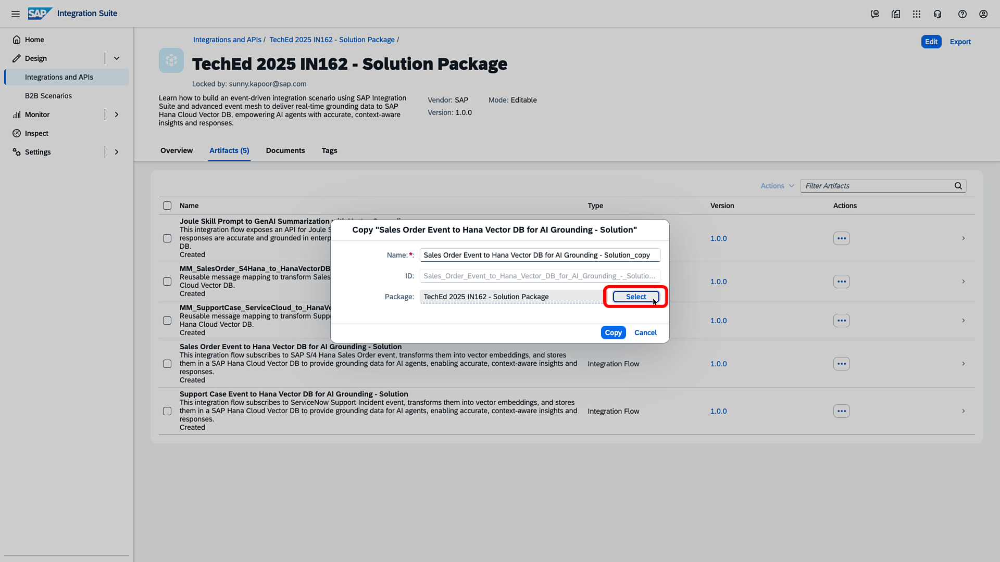

4. Then click on the '**Select**' button to specify the target Package to copy this content into. A package selection dialog will open up. 

   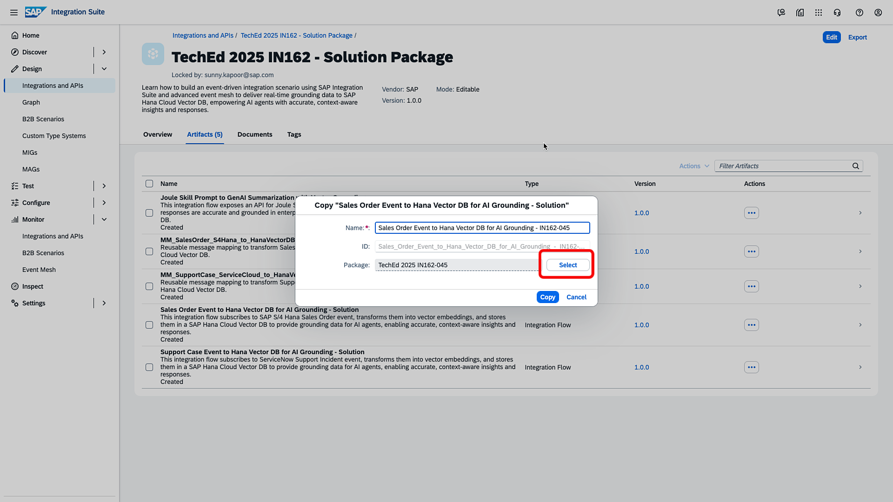 

5. Select the target package that you had created in the first segment of Exercise 3 i.e. **TechEd 2025 IN162-`0xx`**, replace the **`xx`** with your assigned user idenfifier.
    After this, click on 'Copy'.

   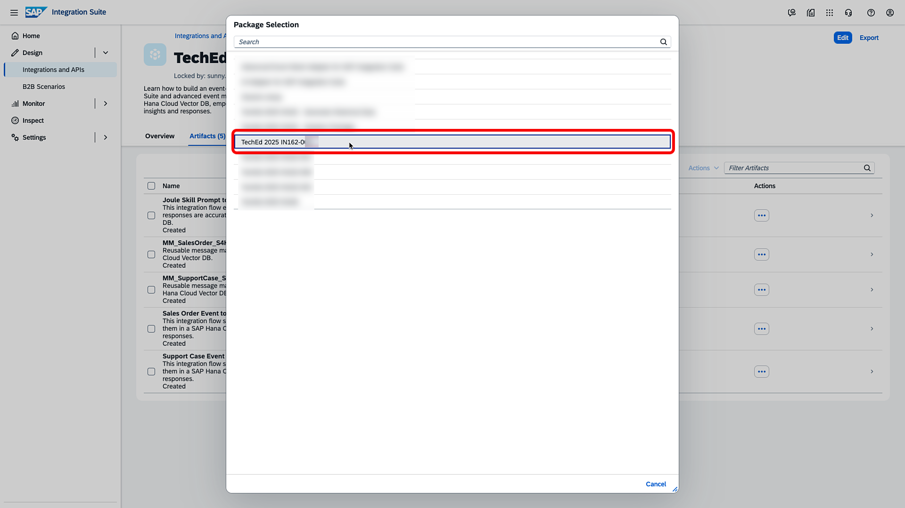
   
6. After the copy is successful, navigate to the copied package by clicking on the '**Navigate**' button in the presented dialog.

   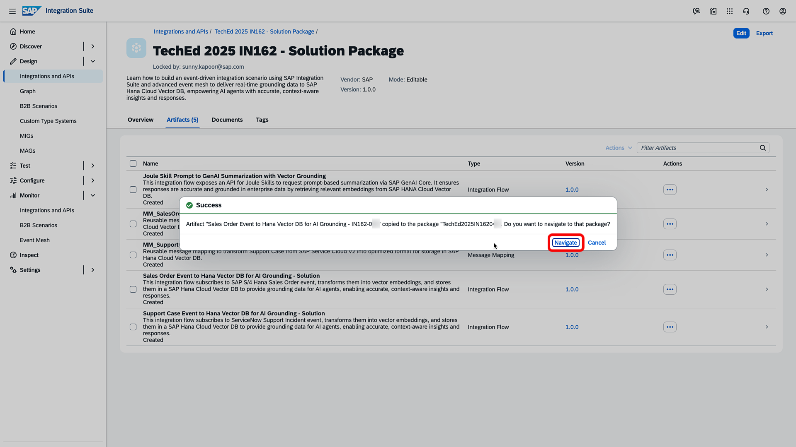

## Step 2 - Configure the Integration Flow with your user settings 
Now that the integration flow has been copied, we will configure it with certain externalized parameters in the next few steps. 

1. Make sure you are in your own created package i.e. **TechEd 2025 IN162-`0xx`**, replace the **`xx`** with your assigned user identifier. \
   Go to the '**Artifact**' tab. Select the copied integration flow i.e. **`Sales Order Event to Hana Vector DB for AI Grounding - IN162-0xx`**, replace the **`xx`** with your assigned user identifier.  Click on the '**...**' Action menu button, and click '**Configure**'.

   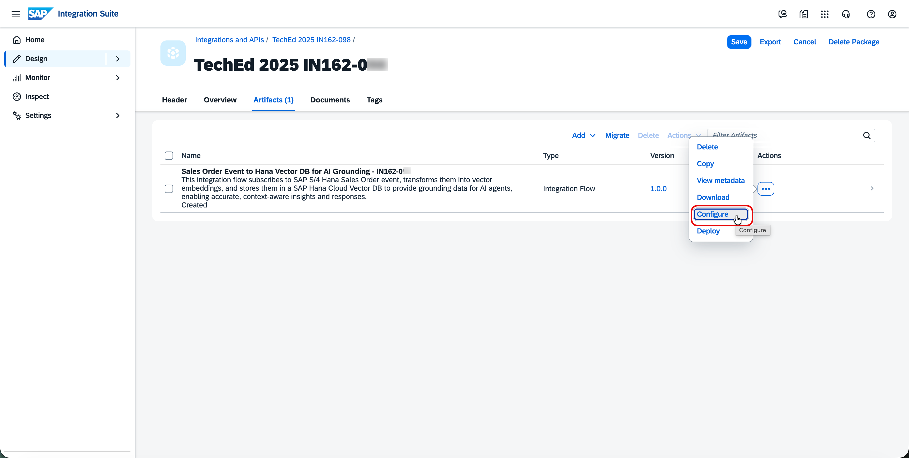
   
2. The configuration dialog will pop open. In the '**Queue Name**' text box of the '**Sender**' tab, enter **'IN162-`0xx`_Sales_Order'**, replace the **`xx`** with your assigned user identifier.

   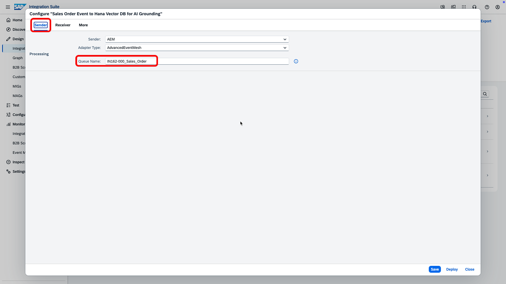

3. Next, navigate to the '**Receiver**' tab and replace the entire value with deployment URL that you copied in [Exercise 2](../ex2/README.md#exercise-22---create-deployment) i.e. 'https://api.ai.prod.eu-central-1.aws.ml.hana.ondemand.com/v2/inference/deployments/`your-deployment-id-here`' in the '**AI_Launchpad_URL**' textbox.

   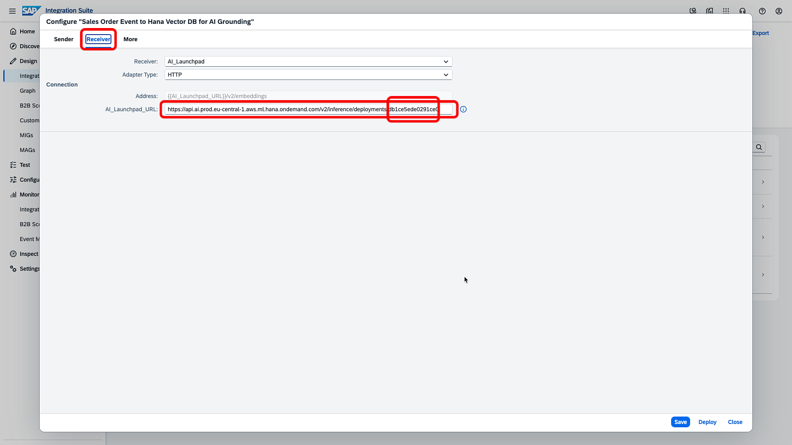
   
4. Move over to the '**More**' tab, in the '**Assigned_Participant_ID**' text box, enter **IN162-`0xx`**, replace the **`xx`** with your assigned user identifier. \
   Click on '**Save**' button to save your configuration settings.

   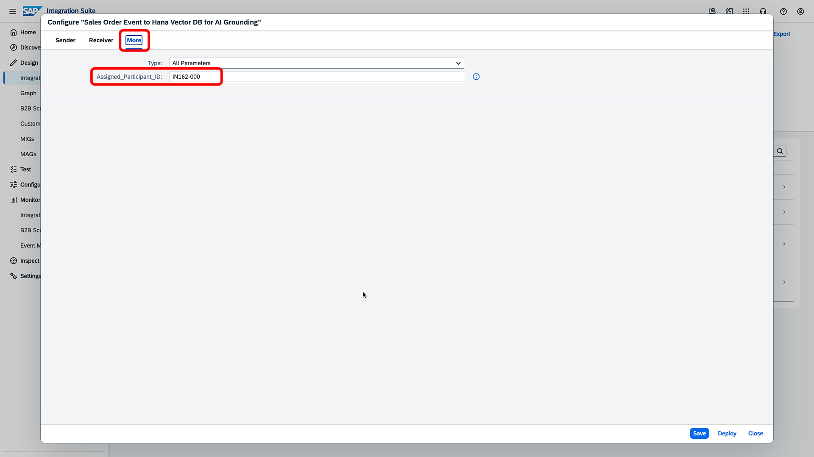

## Step 3 - Deploy the Integration Flow 
Now that the configuration is complete, we will move ahead and deploy the integration flow.

1. Click on '**Deploy**' in the configuration dialog from the previous step. OR you can open editor to '**Deploy**' the flow
   Select the default '**Cloud Integration**' as the runtime profile to deploy the content into.

   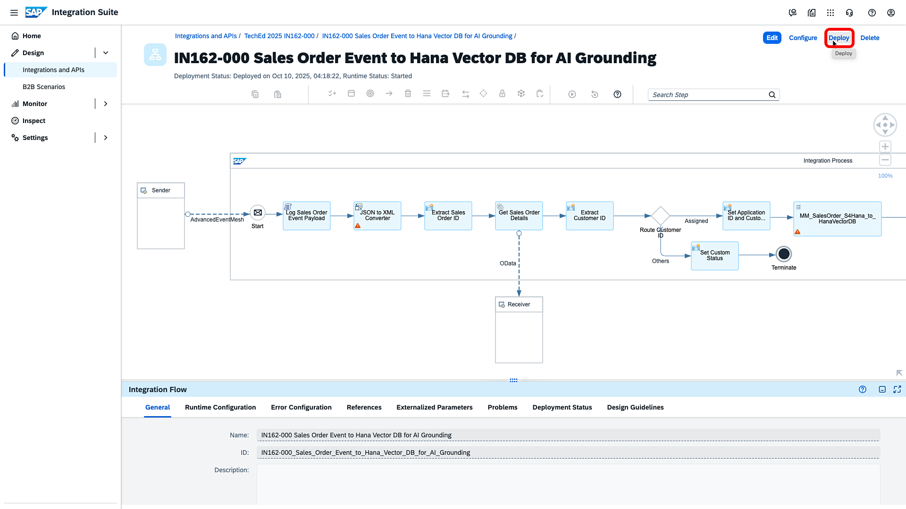
   

2. A dialog will confirm the deploy action.

   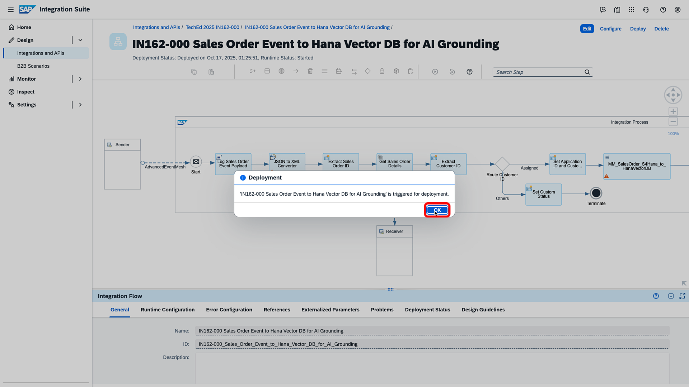

3. A message toast will confirm the successful completion of the deployment step.

   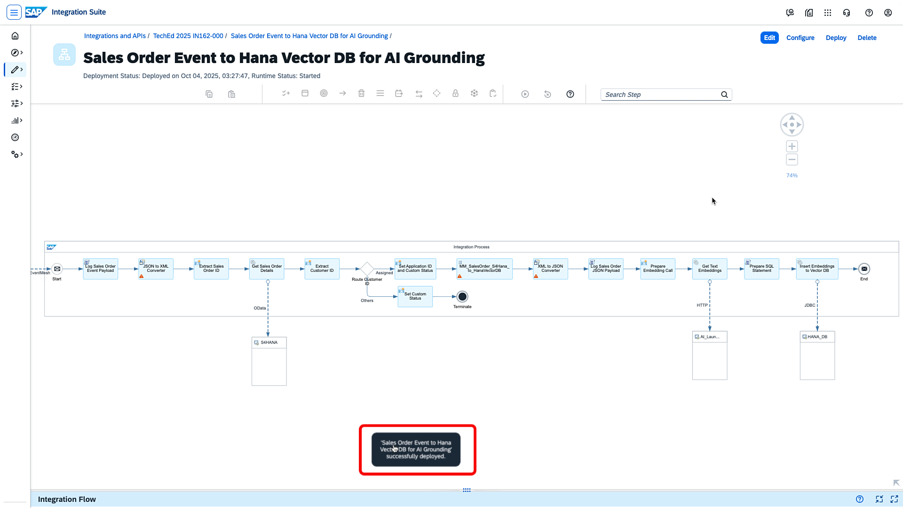

4. The integration flow is in the '**starting**' phase now. Click on the integration flow to bring up the model. After a minute or so, you should see the '**Runtime Status**' change to '**Started**'. This means that the integration flow is ready and listening for changes.

   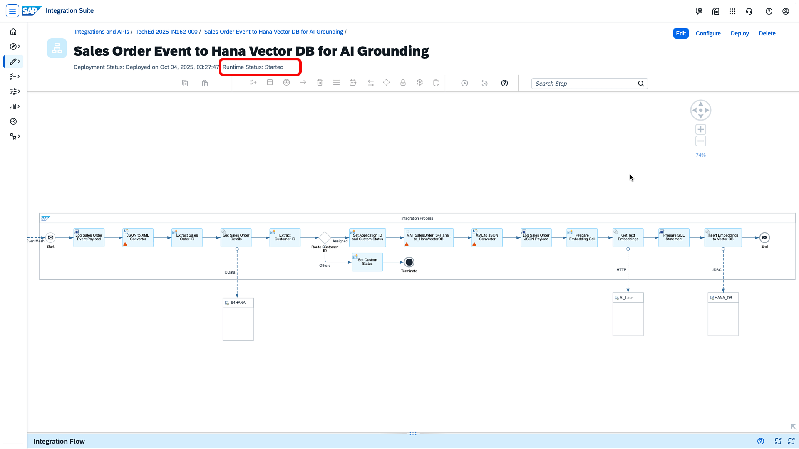

## Step 4 - Explore the sequence of steps used in the Integration Flow 
It is highly recommended that you review the integration flow in detail to gain a broader understanding of its functionality. You can do so by navigating to [Exercise 3.1](./ex3_1_details.md) and inspecting the complete sequence.

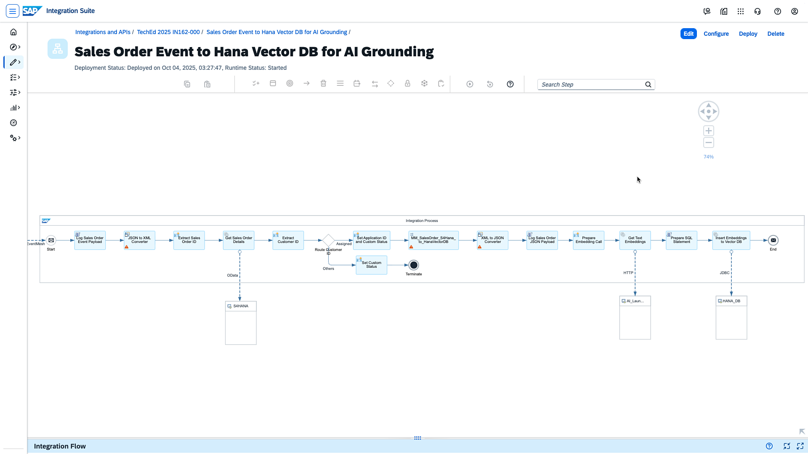

## Summary

This completes Exercise 3, next proceed to [Exercise 4](../ex4/README.md), where we will achieve a similar flow to consume events emitted from **support case creation in SAP Service Cloud V2 system**.
