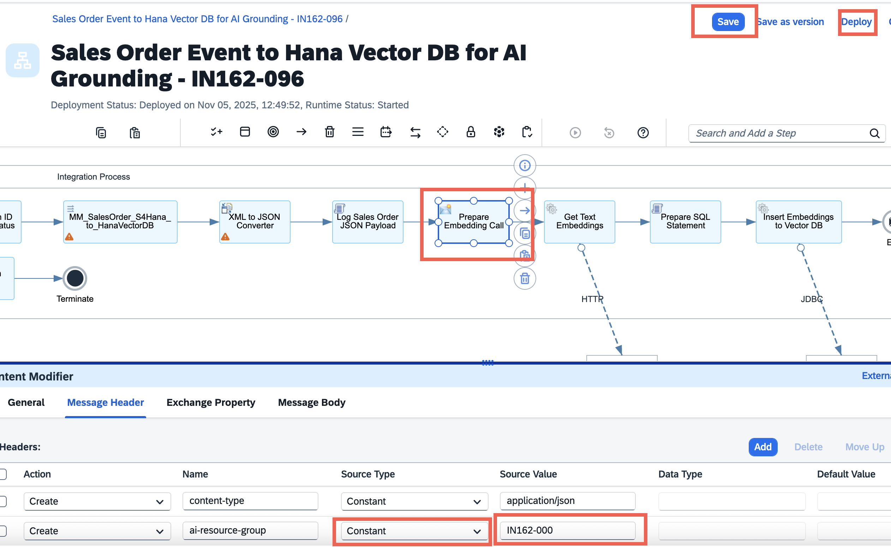

#  Troubleshooting

In case the deployment of your AI Core configuration fails, you will need to perform a few manual changes to get going.

 

## Step 1 - Go to the 'Prepare Embedding Call' content modifier step

1. Go to the 'Prepare Embedding Call' Content modifier step and in the 'Message Header' section, modify the 'source Type' and 'Source Value' to '**Constant**' and '**IN162-000**' respectively. 
2. Click on **Save** and **Deploy**
