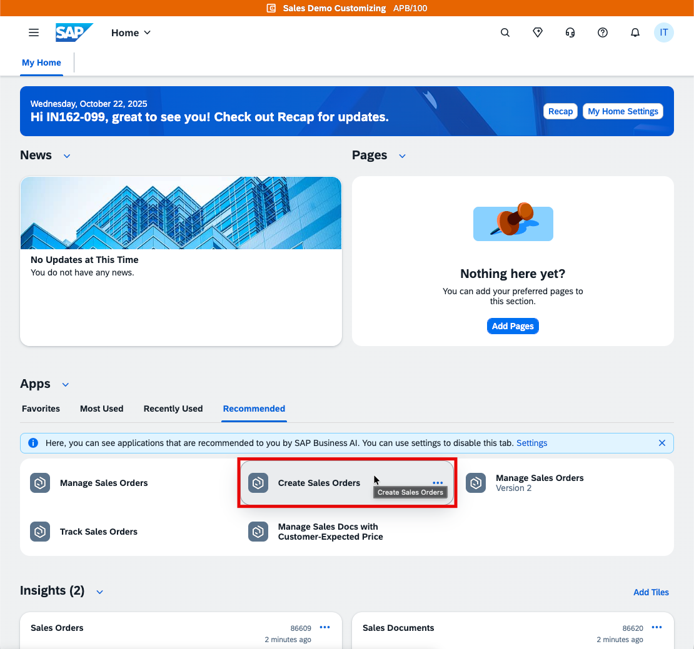
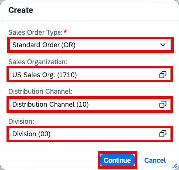
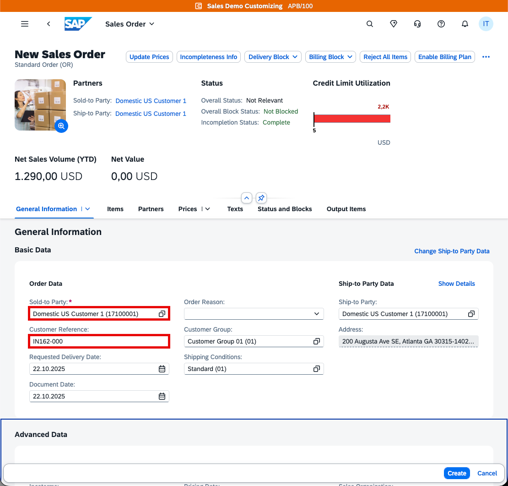
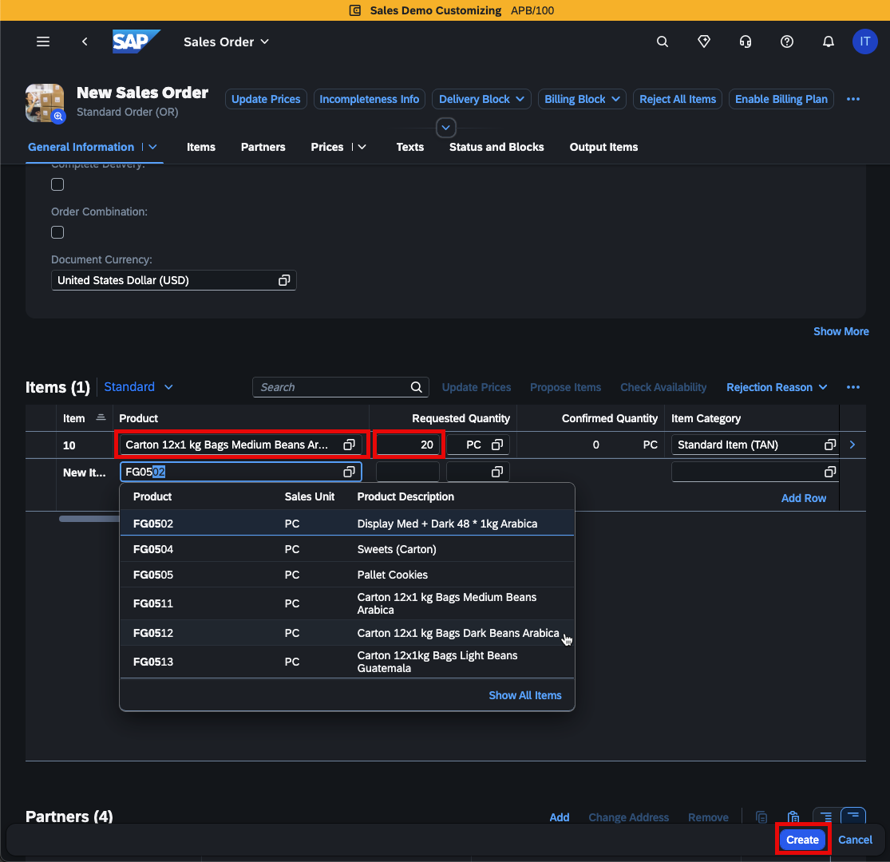
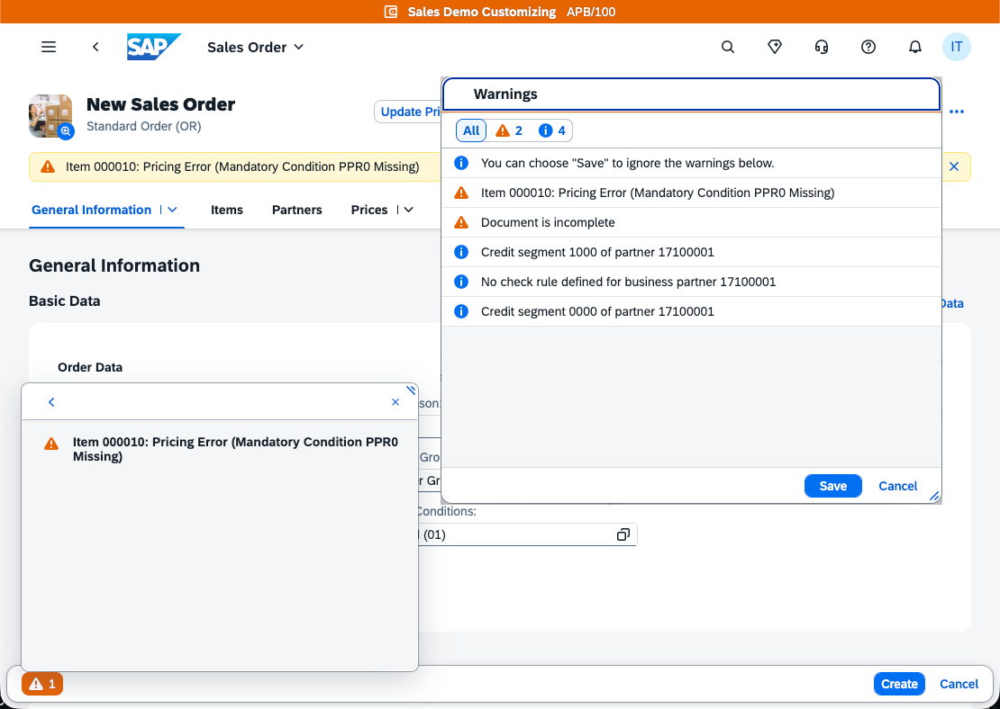
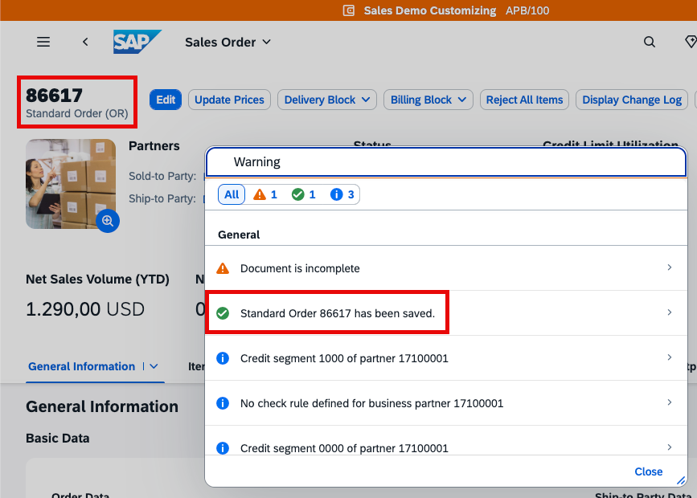
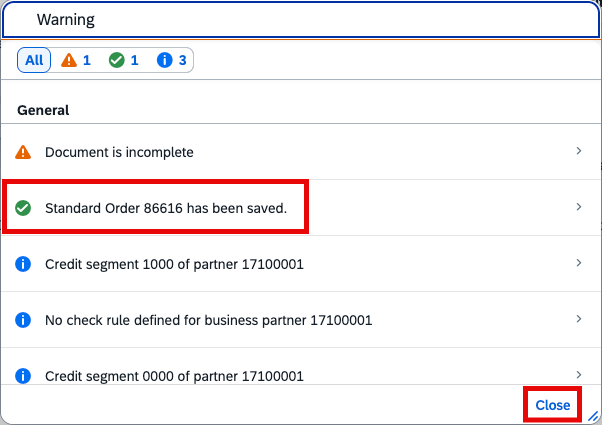

# Exercise 5.1 - Create a new Sales Order in S/HANA Cloud system

In this exercise, we will create a new Sales Order in SAP S/4HANA Cloud system that will eventually trigger the integration flow that we built in [Exercise 3](../ex3/README.md)

1. Log on to [SAP S/4HANA Cloud](https://my427029.s4hana.cloud.sap/ui) system
   Username/Password: provided by the moderator

2. Find on the displayed landing page the **Apps** section. Under **Recommended** you will find the **Create Sales Orders** app.\
   Click the tile to start the Sales Order creation wizard.   

   

3. Provide the following details to create the new Sales Order:

   

   - Sales Order Type: **Standard Order (OR)**
   - Sales Organization: **US Sales Org. (1710)**
   - Distribution Channel: **Distribution Channel (10)**
   - Division: **Division (00)**

   Finally, click on **Continue**.
    
> [!TIP]
> You can use the value help for each field to select the desired entry.

4. You need to fill in further details for the Sales Order to be created

   

   - Sold-to Party: **Domestic US Customer 1 (17100001)**
   - Customer Reference: **IN162-`XXX`** (replace `XXX` with your assigned group identifier)
  
> [!IMPORTANT]
> All participants are using the same **Sold-to Party**. Enter your group identifier in the **Customer Reference** field. This ensures the Sales Order is correctly associated with your participant group.

5. Scroll further down to the **Items** section\
   You can add as many items to your order as you would like.

   

   - Select any of the available products from the list. A good starting point is the products starting with `FG`. :wink:
   - Provide the amount that you would like to order and hit `ENTER` key to complete the entry.
   - A new empty entry will appear.
   - Once finished, click on the **Create** button.

> [!NOTE]
> Depending on the products that you selected, you might see a warning message.
> In most cases, you can safely ignore this message and simply click **Save**. 

6. The new Sales Order has been successfully created in the system. A new event has been published in the background to AEM. 

   

> [!NOTE]
> If you have seen a warning message in the previous step, you'll also see a warning in the summary.
> Still, your Sales Order should have been successfully created. Click on the **Close** button. 

 ## Summary
 This wraps up the 'Sales Order' creation process. An event would have been triggered now based on the settings we [defined](../ex1/README.md#exercise-12---create-first-queue-and-subscribe-to-sales-order-topic-in-sap-integration-suite-advanced-event-mesh-aem) on the AEM side. The notification will be picked up from the AEM Adapter and trigger the IFlow.

 Once the flow completes, we can review the execution path in the [next exercise](./ex5_2_details.md).
