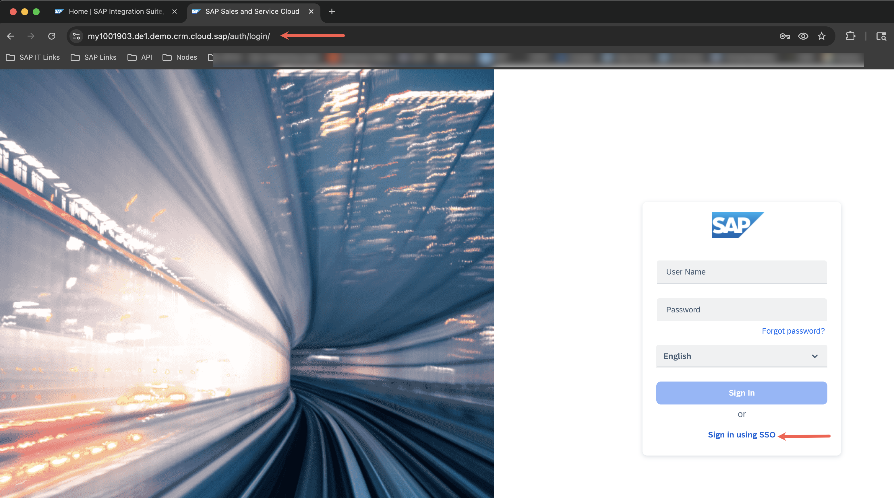
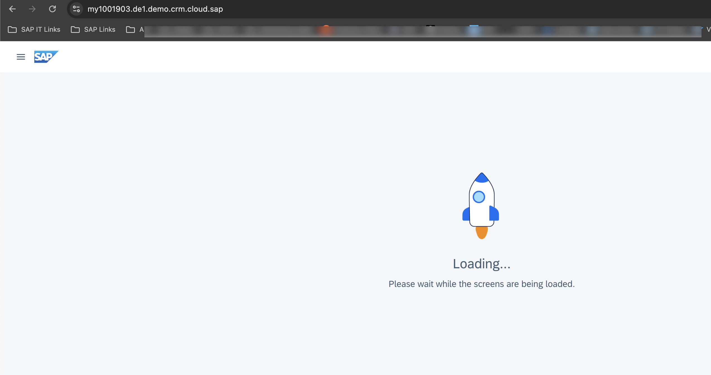
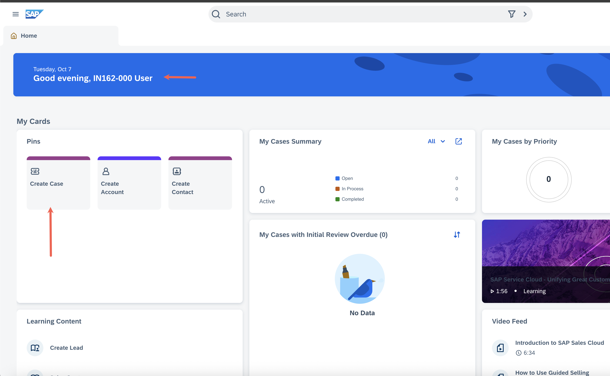
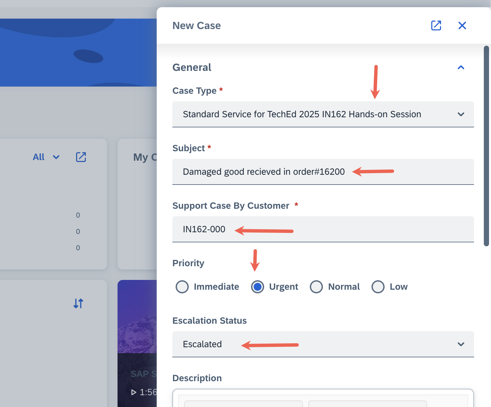
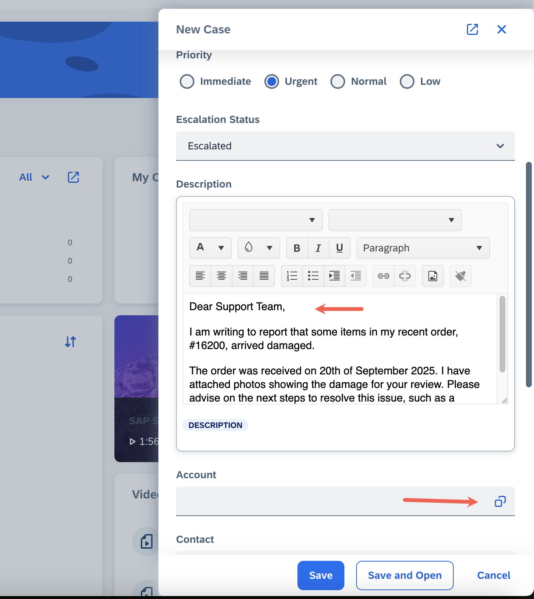
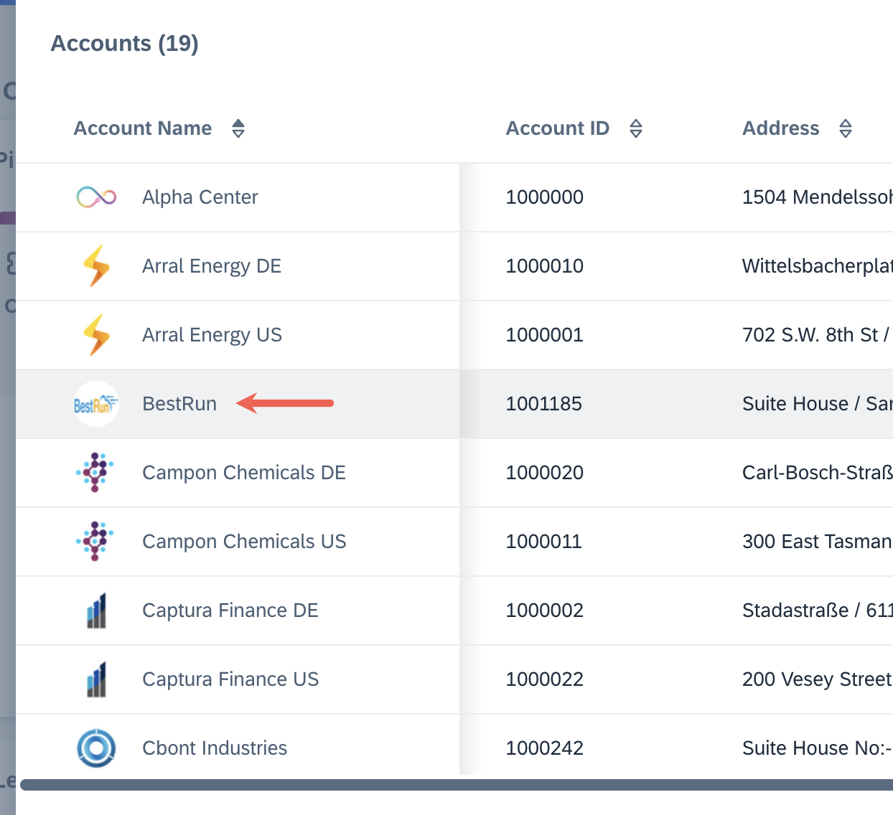
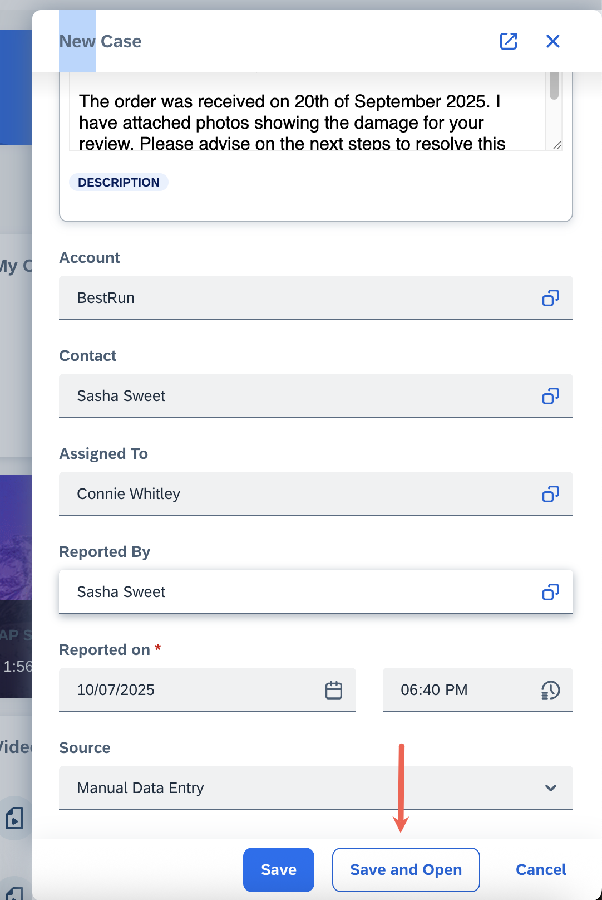

# Exercise 5.3 - Create a new Support Case in SAP Service Cloud Version 2 system

In this exercise, we will create a support case in SAP Service Cloud Version 2 that will eventually trigger the integration flos that we built in [Exercise 4](../ex4/README.md)

## Step 1 - Log on to SAP Service Cloud Version 2 system

1.  Paste the URL: `https://my1001903.de1.demo.crm.cloud.sap/` in your browser window where you would have previously logged into the AEM URL (`https://eu10.console.pubsub.em.services.cloud.sap/login?tenant-id=8b4a1697-2b58-4571-a986-1377cc070073`) as part of [Exercise 1](../ex1/README.md#exercise-11---log-into-advanced-event-mesh-and-explore-it)

    > [!IMPORTANT]
    > The reason why you are expected to use the same windows is that the login session to SAP Service Cloud utilizes SAML browser cookies to extend SSO from AEM.
    > 
    > If you have closed all browser windows, make sure to log into AEM and then open SAP Service Cloud Version 2 in a separate tab of the same window.
    > 
    Click on 'Sign in using SSO'.

    

2.  The system will log you in.

    

3.  Click on 'Create Case'.

    

4.  In the 'new case' window, use the pre-configured Case Type. Use the table to enter the values:
    | Field | Value |
    | ----- | ----- |
    | Case Type | Standard Service for TechEd 2025 IN162 Hands-on Session |
    | Subject | Damaged goods received in Order#1620** (replace `**` with your assigned participant number) |
    | Support Case By Customer | IN162-`0**` (replace `**` with your assigned participant number) |
    | Priority | Urgent |
    | Escalation Status | Escalated |
    | Description | Dear Support Team, I am writing to report that some items in my recent order, #1620** (replace `**` with your assigned participant number), arrived damaged. The order was received on 20th of September 2025. I have attached photos showing the damage for your review. Please advise on the next steps to resolve this issue, such as a replacement or refund. Thank you for your assistance. |
   
    

5.  Click on the F4 (drop-down) button for the **'Account'** section.

    

6.  A dialog loads all the configured Accounts. From the list, select **‘BestRun’** to proceed.

    

7.  You will see that all other fields, like **'Contact'**, **'Assigned To'**, etc., will be auto filled based on your selection. Retain these values and finalize the settings by creating **'Save and Open'**. 

    
    

    ## Summary
    This wraps up the 'support case' creation process. An event would have been triggered now based on the settings we [defined](../ex1/README.md#exercise-13---create-second-queue-and-subscribe-to-support-case-topic-in-sap-integration-suite-advanced-event-mesh-aem) on the AEM side. The notification will be picked up by the AEM Adapter and trigger the IFlow.

    Once the flow completes, we can review the execution path in the [next exercise](./ex5_4_details.md).

