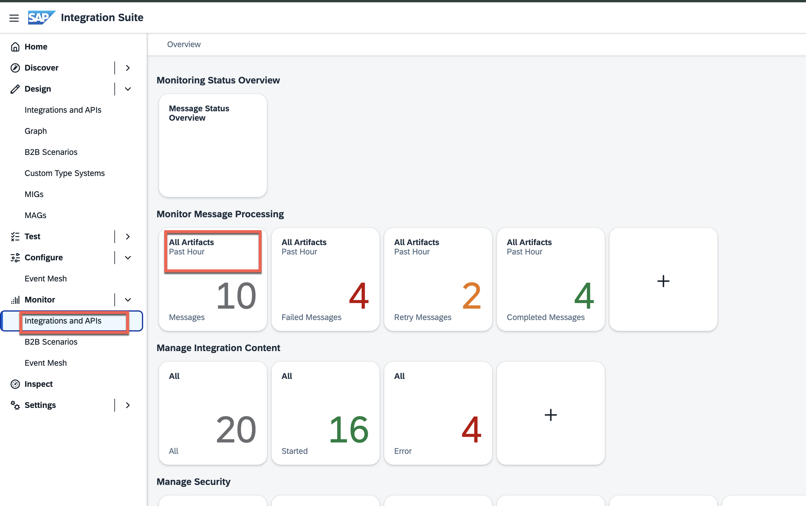
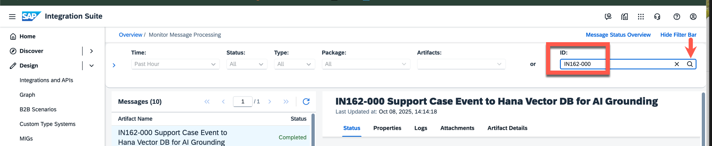
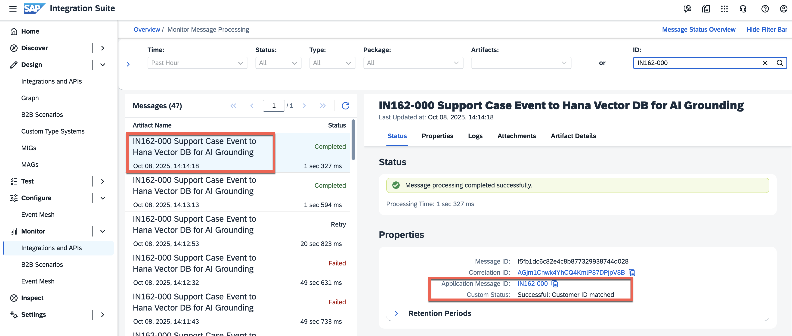
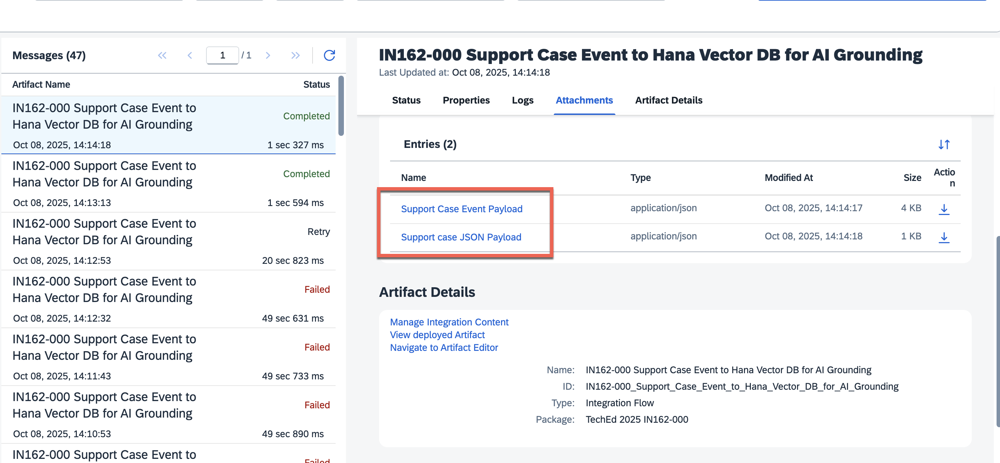
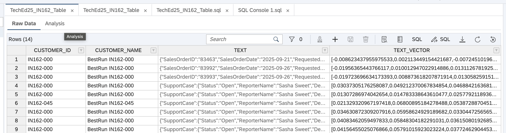

# Exercise 5.4 - Monitor Message Processing Logs in Cloud Integration after Support Case Creation

In this exercise, we will monitor the message processing logs in the Integration Suite Monitoring tab.

1. Navigate to **'Monitor' -> 'Integration and APIs'** tab from the Integration Suite's main page. Click on the **'All Artifacts'** tile.

   

2. This will bring up the **'Monitoring Message Processing'** screen. Enter your user identifier **IN162-0**** *(replace ** with the participant number that is assigned to you)* in the **'ID:'** search box.

   

3. You may remember that we had assigned the **Application_ID** header only when a matching condition was met. Hence, you will see the message entries filtered only for your individual execution runs. You can verify that the **'Custom Status'** will always point to **'Successful: Customer ID matched'**.

   

4. Scroll down further, and in the **'Attachments'** section, you will be able to see 2 files as attachments. These files represent the incoming event payload and the final flattened JSON payload produced after the message mapping step. 

   

5.  Though inspecting the HANA Database is not part of our hands-on execise, here is a screenshot of the `TechEd25_IN162_Table` table in HANA, that is populated with the SalesOrder and SupportCase payload and the corresponding vectorized text embeddings.
    

## Summary
This concludes the monitoring aspects of the Support Case object. In the [next exercise](../ex6/README.md), let's go ahead and provide a prompt in the Joule-powered customer success digital assistant to retrieve the summarizations based on these latest sales orders and suport cases.
