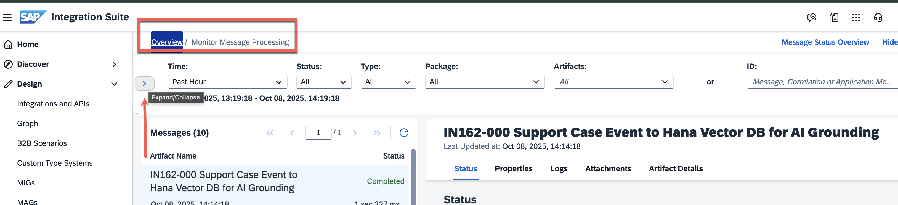
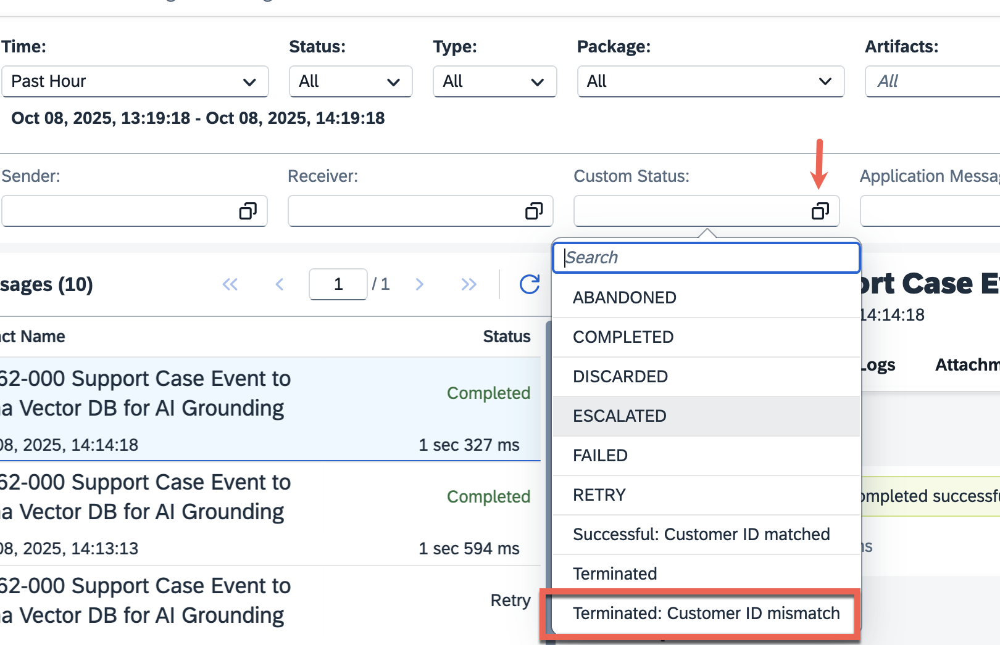
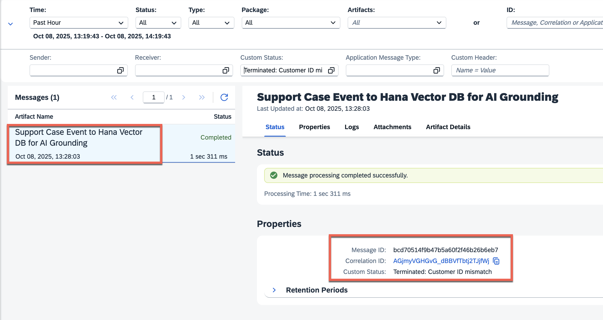

# Exercise 5.4 - Monitor Integration Processing Logs for Support Case creation

In this exercise, we will monitor the processing logs from the Integration Suite's Monitoring tab

1. Navigate to 'Monitor' -> 'Integration and APIs' tab from the Integration Suite's main page. Click on the 'All Artifacts' tile.
    

2. This will bring up the 'Monitoring Message Processing' screen. Enter your user identifier (e.g., IN162-000) in the 'ID:' search box. 
    

3. You may remember that we had assigned the Application_ID header only when a matching condition was met. Hence, you will see the message entries filtered only for your individual execution runs. You can verify that the 'Custom Status' will always point to 'Successful: Customer ID matched'.
    

4. Scroll down further, and in the 'Attachments' section, you will be able to see 2 files as attachments. These files represent the incoming event payload and the final flattened payload produced after the message mapping step.
     
5. If you are curious to see the entries that correspond to other participants and were discarded, go back to the Overview -> Monitoring Message Processing tile. Click on the '>' button located in the top left side of the screen to open a detailed panel.
    

6. Look for the 'Custom Status' drop-down and select 'Terminated: Customer ID mismatch' from the value help.
    

7. You can see messages to the same IFlow, but classified with the 'Terminated' custom status. Additionally, you can look at the 'attachments' section and verify that the `SupportCaseByCustomer` attribute carries a different identifier from yours. 
    

## Summary
This concludes the monitoring steps. In the [next exercise](../ex6/README.md), let's go ahead and build a Joule skill to retrieve the summarizations from our AI model.
