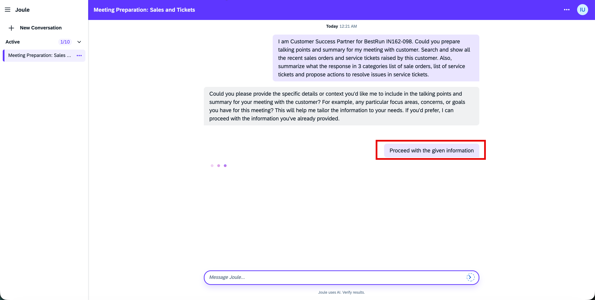

# Exercise 6 - Customer Success Digital Assistant: Extending Joule with Joule Skill using Real-Time Vector Grounding
In this last exercise, you will provide a user input as a prompt to the Joule-powered Customer Success Digital Assistant to generate a summary of talking points for a customer meeting with the latest information on Sales Orders and Support Tickets.
The focus of this hands-on session is to build and run real-time grounding for LLMs using the SAP Integration Suite. In this exercise, you will use a pre-built integration flow and a pre-built Joule Skill. The integration flow, **“Joule Skill Prompt to GenAI Summarization with Vector Grounding”** is exposed as an API, which is invoked by the Joule Skill **“Customer Success Assistant”** using the SAP Build Action to generate contextually grounded responses.

### No artifact development is required in this exercise. You will use the pre-built artifacts to generate a summary for the customer meeting as a Customer Success Manager.

## Exercise 6.1 - Generate summary of talking points for a customer meeting considering latest customer's sales orders and support tickets

1. Open the standalone Joule for testing purposes
	1. https://in162-ntn259xc.eu10.sapdas.cloud.sap/webclient/standalone/sap_digital_assistant
 	2. Moderators will provide you the credentials
 	  
		
	  
2. Provide below prompt as per your assigned user identifier
   1. "I am Customer Success Partner for BestRun <b>IN162-0**</b> *(replace ** with your assigned participant number)*. Could you prepare talking points and summary for my meeting with customer. Search and show all the recent sales orders and service tickets raised by this customer. Also, summarize what the response in 3 categories list of sale orders, list of service tickets and propose actions to resolve issues in service tickets."
 	  
	
	  
	2. Click Send and wait for the response
	  
    
    3. In case Joule assistant again asked for any confirmation, write "Proceed with the given information".
	  
    
	  
4. Check and observe the response from Joule
	1. Response will have a list of recent and old sales order and support tickets raised by the customer IN162-0**
      
    
	  
	2. You can also find the propose actions to resolve and reduce the issues in future
      
    
	  

## Exercise 6.2 - Go through pre-built Integration Flow that summarize the current status of the customer using Generative AI Hub (Optional)

1. You can view the pre-built integration flow on this system
    1. https://workshop-eu-01a.integrationsuite-cpi033.cfapps.eu10-005.hana.ondemand.com/shell/design
    2. Moderators will provide you the credentials
     
2. Open the integration flow "Joule Skill Prompt to GenAI Summarization with Vector Grounding"
	  
   
	  
   
     
   
     
   
     
4. Go through the steps to understand it
   1. Integration flow is triggered using HTTPS sender adapter, this helps us to easily expose as an Action in SAP Build Process Automation (see Exercise 6.2 for details)
   2. The user input (entered in Joule) is send to AI Core for generation of embeddings. An embedding model
   3. These embedding are used to search the matching historical information (sales orders and service tickets) from HANA Vector DB through JDBC call
   4. The response is then summarized using AI Adapter and sent back 
   
     

## Exercise 6.3 - Go through pre-built Joule Skill to trigger the Integration Flow as an Action for generation of key talking points for customer meeting (Optional)

1. You can access the pre-built Joule skill on this system
	1. https://in162-ntn259xc.eu10.build.cloud.sap/
	2. Moderators will provide you the credentials
2. Understand Action details for Joule Skill in SAP Build Process Automation
	1. "Joule Skill Prompt to GenAI Summarization with Vector Grounding" integration flow was used to create an Action
	2. The above action was added to "GenAI Summarization with Vector Grounding" Action Project
	3. Input and Output  were defined to take user input (prompt) as input and get the summarized output
      
   	
	  
	
	  
	
	  
	
	  
	
	  
	4. "Customer Success Assistant" Joule Skill was created in "IN162_Custome_Success_Assistant" project using the Action created in previous step.
	  
	
	  
	
	  
		
	  
		
	  
		
	  
		
	  

# Summary
We have successfully executed the completed the hands-on exercise from real time ingestion of Sales order and service ticket data to the generation of talking points along with proposal for remedial actions and proposals to avoid issues in future based on the latest information available.
