# Exercise 6 - Generate summary of talking points for Customer meeting by estending Joule with Joule Skill
In this final exercise, you will provide a user input as prompt to Joule to generate the summary of talking points. You will also understand how Customer Success Manager can use Joule Skill and Integration Flows to prepare customer meeting with latest information about the Sales Orders and Support Tickets
The focus of the hands-on is to build and run real time grounding for LLMs using Integration Suite thus in this exercise we provide you a pre-build Integration Flow and pre-build Joule Skill. Integration Flow "Joule Skill Prompt to GenAI Summarization with Vector Grounding" is exposed as an API which intern is called from Joule Skill "Customer Success Assistant". 

You need not build the any of the artifacts in this exercise but you will use the Joule Skill to generate the summarized report.

## Exercise 6.1 - Go through pre-build Integration Flow to summarize the current status of the customer using Generative AI Hub
1. You can view the pre-build Integration Flow on this system
    1. https://workshop-eu-01a.integrationsuite-cpi033.cfapps.eu10-005.hana.ondemand.com/shell/design
    2. Moderators will provide you the credentials
     
2. Open the integration flow "Joule Skill Prompt to GenAI Summarization with Vector Grounding"
	  
   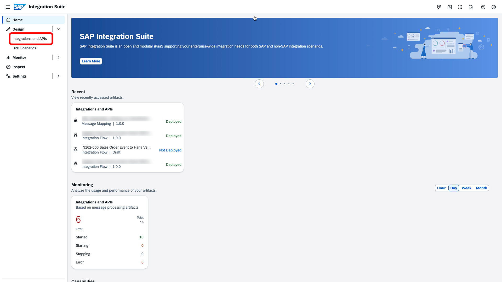
	  
   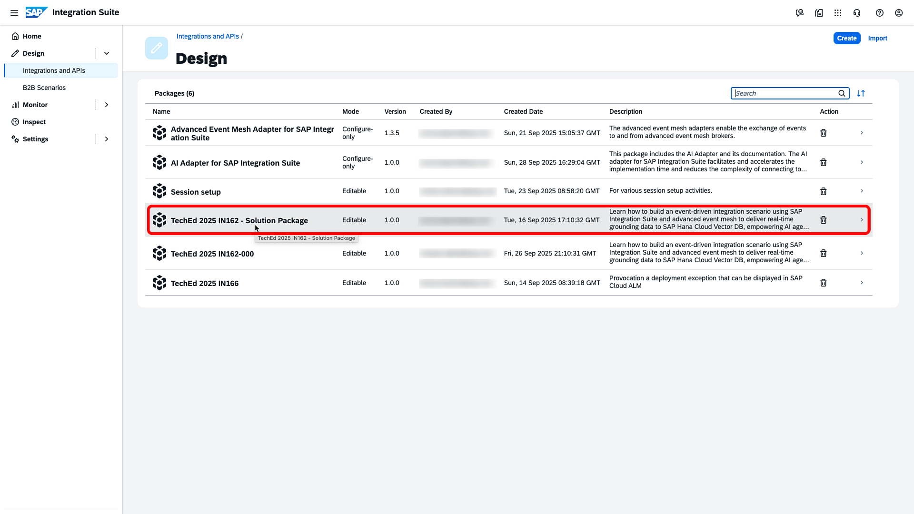
     
   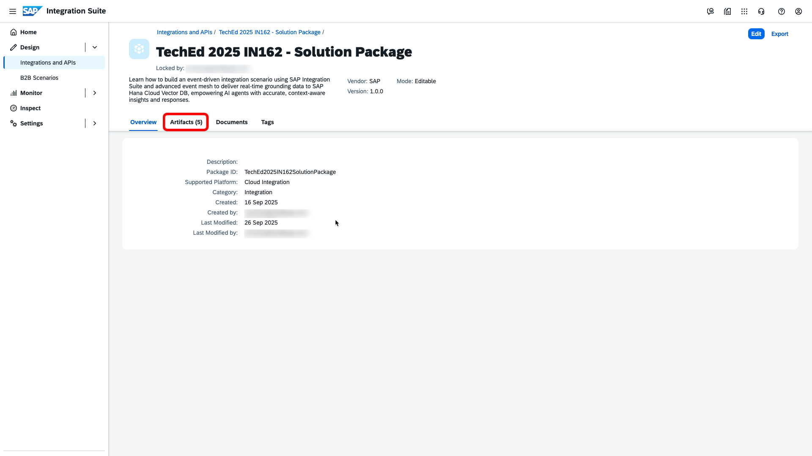
     
   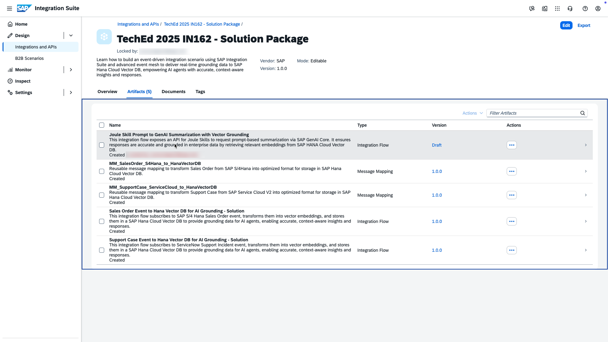
     
4. Go through the steps to understand steps
   1. Integration Flows is triggered using HTTPS sender adapter, this helps us to easily expose Integration Flow as Action in SAP Build Process Automation (see Exercise 6.2 for details)
   2. The user input (entered in Joule) is send to AI Core for generation of embeddings. An embedding model
   3. These embedding are used to search the matching historical information (sales orders and service tickets) from HANA Vector DB through JDBC call
   4. The response is then summarized using AI Adapter and sent back 
   
     
## Exercise 6.2 - Go through pre-build Joule Skill to trigger the generation of key talking points for customer meeting

1. You can access the pre-build Joule skill on this system
	1. https://in162-ntn259xc.eu10.build.cloud.sap/
	2. Moderators will provide you the credentials
2. Understand Action details for Joule Skill in SAP Build Process Automation
	1. "Joule Skill Prompt to GenAI Summarization with Vector Grounding" integration flow was used to create an Action
	2. The above action was added to "GenAI Summarization with Vector Grounding" Action Project
	3. Input and Output  were defined to take user input (prompt) as input and get the summarized output
      
   	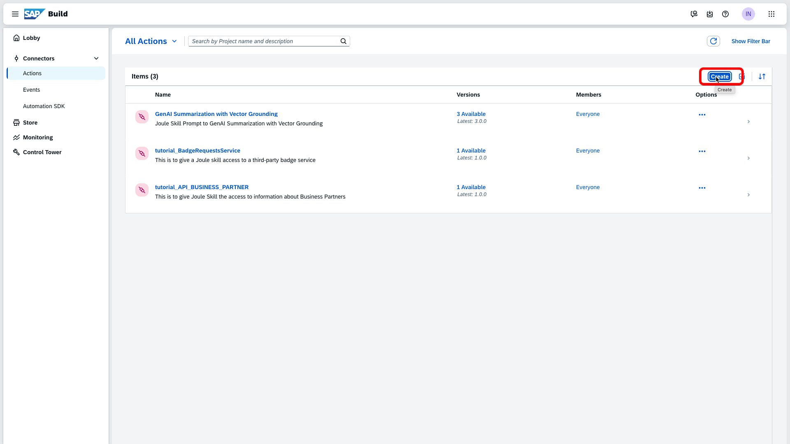
	  
	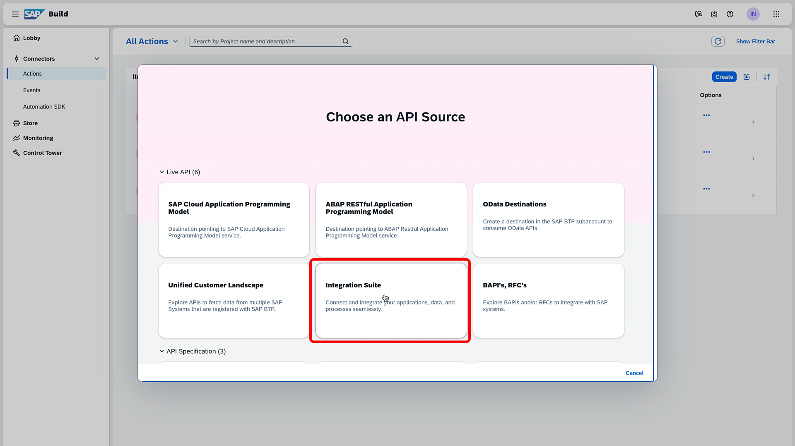
	  
	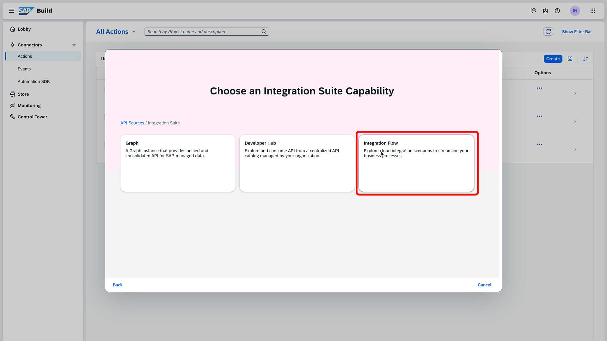
	  
	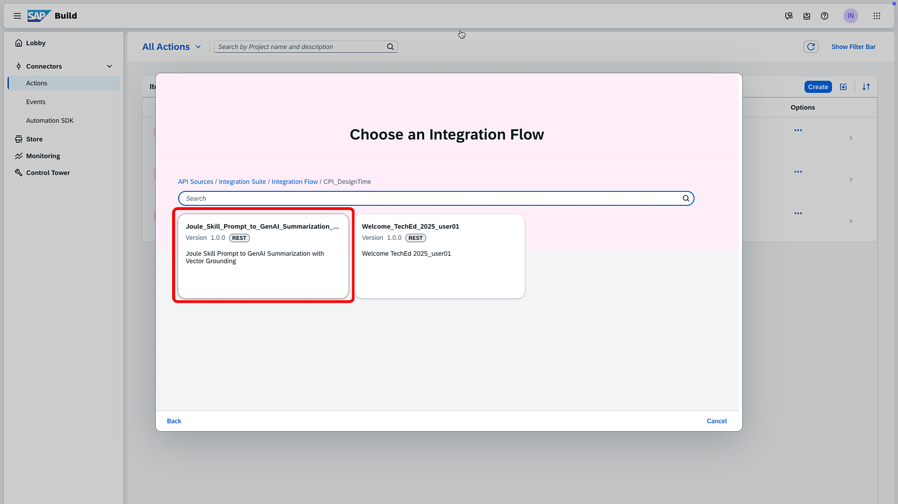
	  
	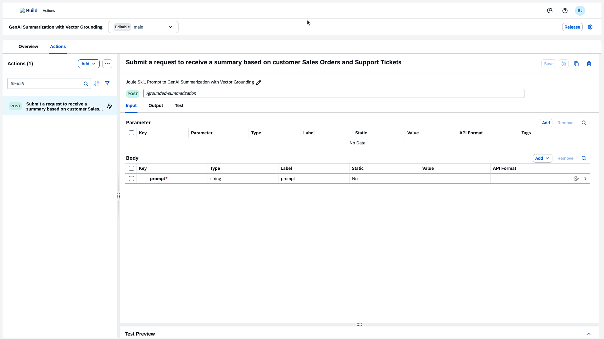
	  
	4. "Customer Success Assistant" Joule Skill was created in "IN162_Custome_Success_Assistant" project using the Action created in previous step.
	  
	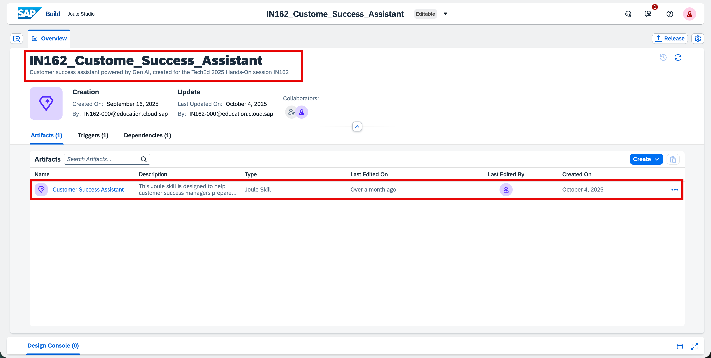
	  
	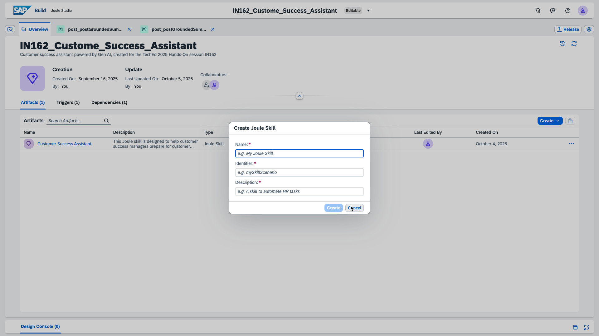
	  
		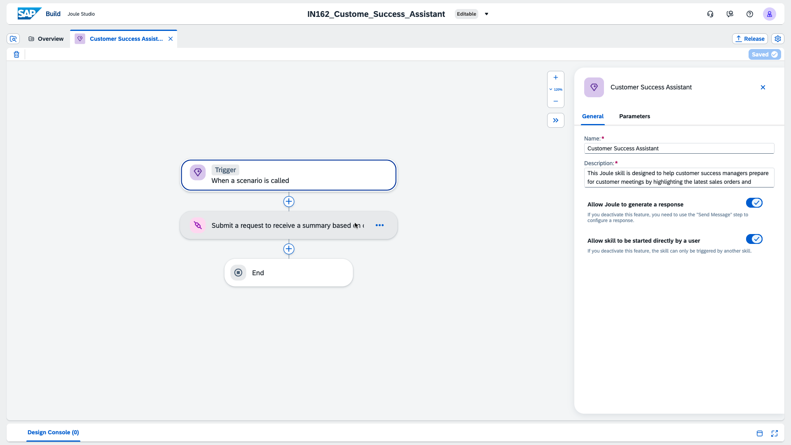
	  
		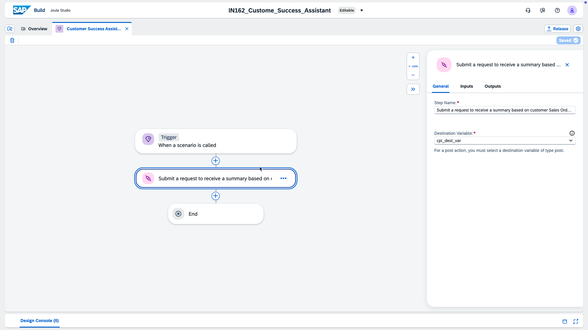
	  
		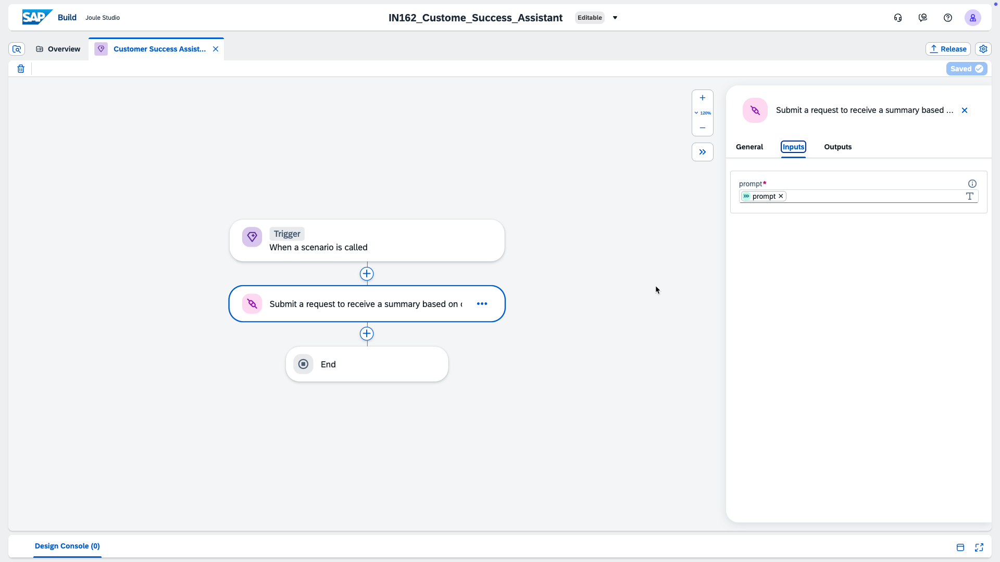
	  
		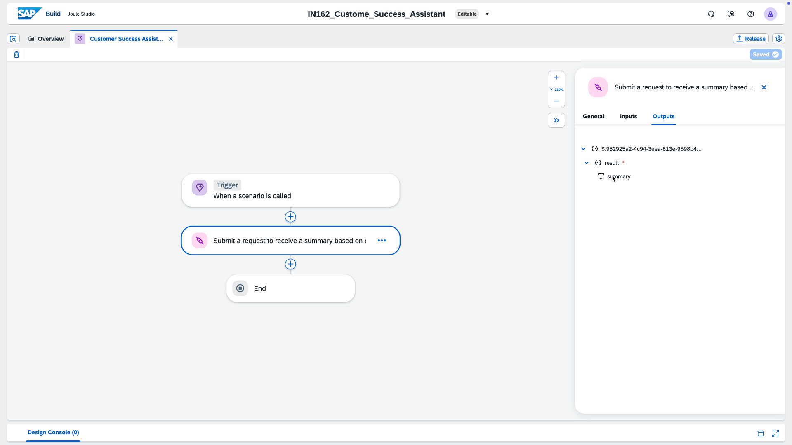
	  
## Exercise 6.3 - Generate customer specific sales order and support ticket summary of talking points

1. Open the standalone Joule for testing purposes
2. Change below prompt as per your user / customer name **(change IN162-000 to IN162-0XX according to your user group)**
	1. I will be meeting my customer, BestRun IN162-000, tomorrow as their Customer Success Partner. Could you help me prepare for the meeting by summarizing and displaying the recent sales order and support tickets? Gave this input
3. Wait for the response from Joule
	1. Response will have a list of historical sales order and list of tickets raised by the customer IN162-0XX

