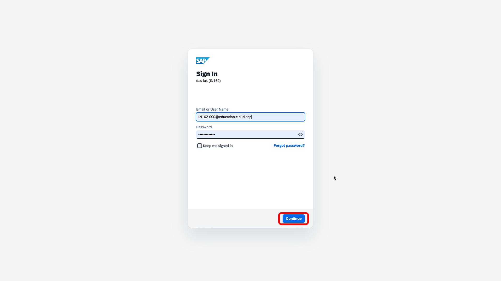
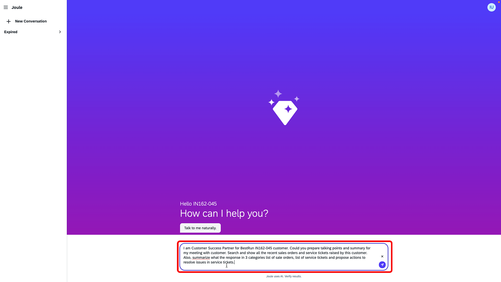
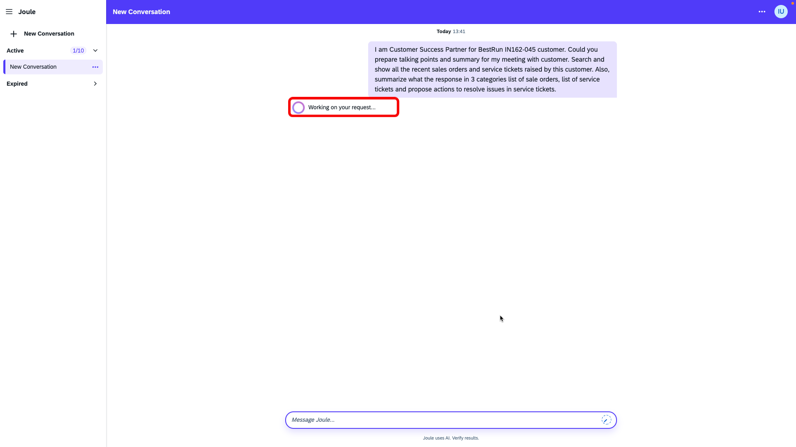
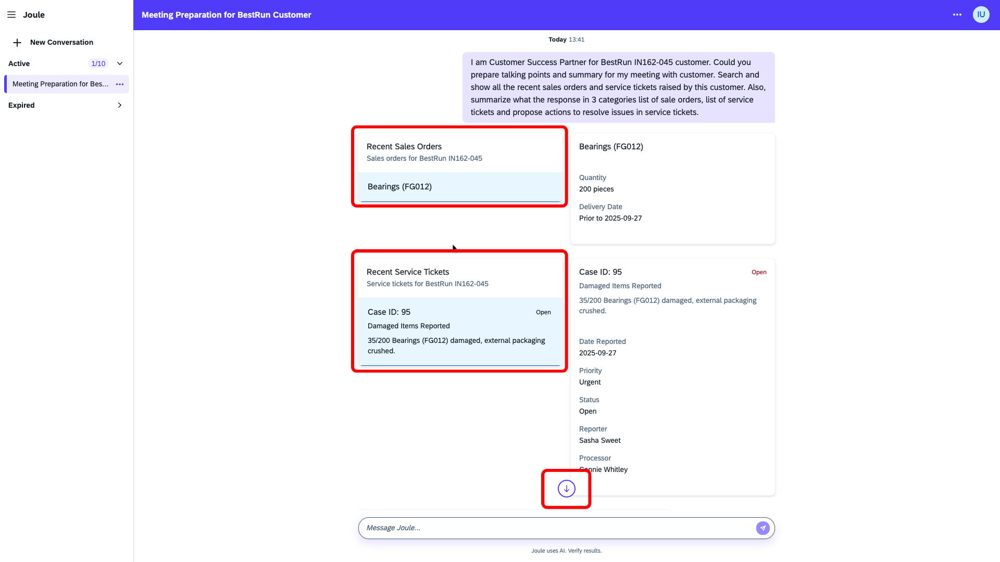
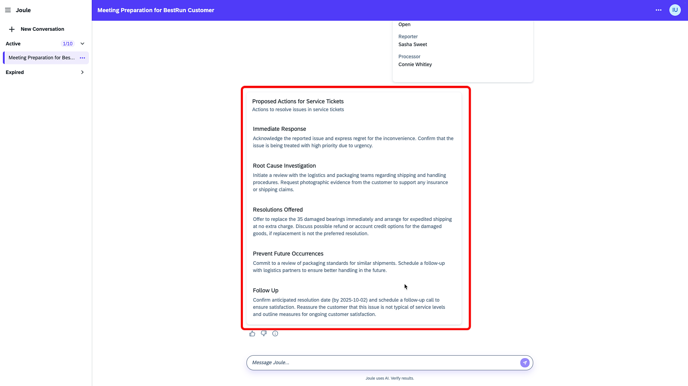

# Exercise 6 - Customer Success Digital Assistant: Extending Joule with Joule Skill using Real-Time Vector Grounding
In this final exercise, you will provide a user prompt to a Joule Studio–powered **Customer Success Digital Assistant** to generate a summary of key talking points for a customer meeting. The assistant will compile the latest information on Sales Orders and Support Tickets to create a concise, GenAI-driven summary.

The Customer Success Assistant is available as a pre-built **Joule Skill** that uses SAP Build Action to invoke an Integration Flow named **Joule Skill Prompt to GenAI Summarization with Vector Grounding** When you submit a request, the Integration Flow performs a semantic search on the SAP HANA Vector Database, which is grounded with recent Sales Order and Service Ticket data. The matched results are then processed through the SAP Integration Suite's **AI Adapter** to generate a contextually relevant summary response.

### No artifact development is required for this exercise. You will use the pre-built artifacts to generate a customer meeting summary, acting in the role of a Customer Success Manager.

The logical sequencing of this exercise can be as follows:

- [Exercise 6.3](./README.md#exercise-63---generate-a-customer-specific-summary-of-sales-orders-and-support-ticket-insights-as-talking-points-for-an-upcoming-meeting) Generate a customer-specific summary of Sales Orders and Support Ticket insights as talking points for an upcoming meeting.
- [Exercise 6.1](./README.md#exercise-61---go-through-pre-built-integration-flow-to-summarize-the-current-status-of-the-customer-using-generative-ai-hub-optional) (Optional) Go through a pre-built Integration Flow that performs a semantic search on the HANA Vector DB and summarizes the current status for the customer using an AI Adapter and  Generative AI Hub.
- [Exercise 6.2](./README.md#exercise-62---go-through-pre-built-joule-skill-to-trigger-the-generation-of-key-talking-points-for-customer-meeting-optional) (Optional) Go through a pre-built Joule Skill to trigger the generation of key talking points for the customer meeting.

## Exercise 6.1 - Go through pre-built Integration Flow to summarize the current status of the customer using Generative AI Hub (Optional)

1. You can view the pre-built Integration Flow by logging into the Integration Suite tenant that you used earlier in Exercises 3 and 4.
     
   
     
2. Navigate to the integration flow "Joule Skill Prompt to GenAI Summarization with Vector Grounding"
	  
   
     
   
     
   
     
3. Go through the steps to understand it
   1. Integration Flows is triggered using an HTTPS sender adapter, which helps us to easily expose Integration Flow as an Action in SAP Build Process Automation (see Exercise 6.2 for details)
   2. The user input (entered in Joule) is sent to AI Core for the generation of embeddings. The same embedding model we used in Exercises 3 and 4 (`text-embedding-3-small`) will be used
   3. These embeddings are used to search the matching historical information (sales orders and service tickets) from HANA Vector DB through a JDBC call
   4. The response is then summarized using AI Adapter and sent back 
   
     

## Exercise 6.2 - Go through pre-built Joule Skill to trigger the generation of key talking points for customer meeting (Optional)

1. You can access the pre-built Joule skill on this system
	1. https://in162-ntn259xc.eu10.build.cloud.sap/
	2. Moderators will provide you with the credentials
2. Understand Action details for Joule Skill in SAP Build Process Automation
	1. "Joule Skill Prompt to GenAI Summarization with Vector Grounding" integration flow was used to create an Action
	2. The above action was added to "GenAI Summarization with Vector Grounding" Action Project
	3. Input and Output  were defined to take user input (prompt) as input and get the summarized output
      
   	
	  
	
	  
	
	  
	
	  
	
	  
	4. "Customer Success Assistant" Joule Skill was created in "IN162_Custome_Success_Assistant" project using the Action created in the previous step.
	  
	
	  
	
	  
		
	  
		
	  
		
	  
		
	  

## Exercise 6.3 - Generate a customer-specific summary of Sales Orders and Support Ticket insights as talking points for an upcoming meeting.

1. Open the standalone Joule for testing purposes
	1. https://in162-ntn259xc.eu10.sapdas.cloud.sap/webclient/standalone/sap_digital_assistant
 	2. Moderators will provide you with the credentials
 	  
		
	  
2. Change the prompt below as per your assigned user/customer name
	1. "I am Customer Success Partner for BestRun <b>IN162-0**</b> *(replace ** with your assigned participant number)*. Could you prepare talking points and a summary for my meeting with the customer? Search and show all the recent sales orders and service tickets raised by this customer. Also, summarize what the response is in 3 categories: list of sale orders, list of service tickets, and propose actions to resolve issues in service tickets."
 	  
	
	  
	2. Click Send and wait for the response
	  
    
	  
3. Check and observe the response from Joule
	1. Response will have a list of historical sales orders and a list of tickets raised by the customer IN162-0**
      
    
	  
	2. You can also find the proposed actions to resolve and reduce the issues in the future
      
    
	  

# Summary
We have successfully executed the completed the hands-on exercise from real time ingestion of Sales order and service ticket data to the generation of talking points along with proposal for remedial actions and proposals to avoid issues in future based on the latest information available.

