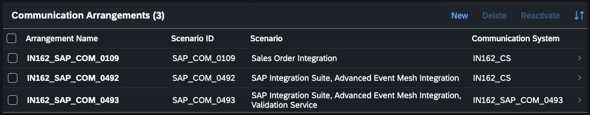
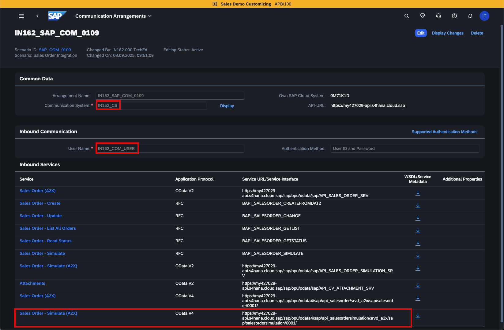
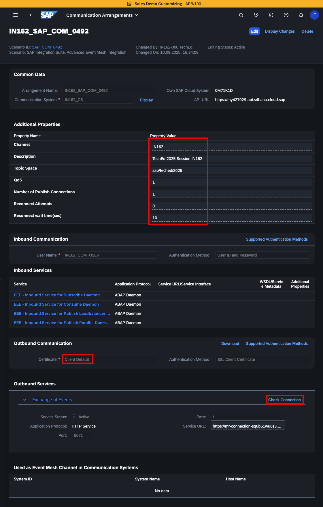
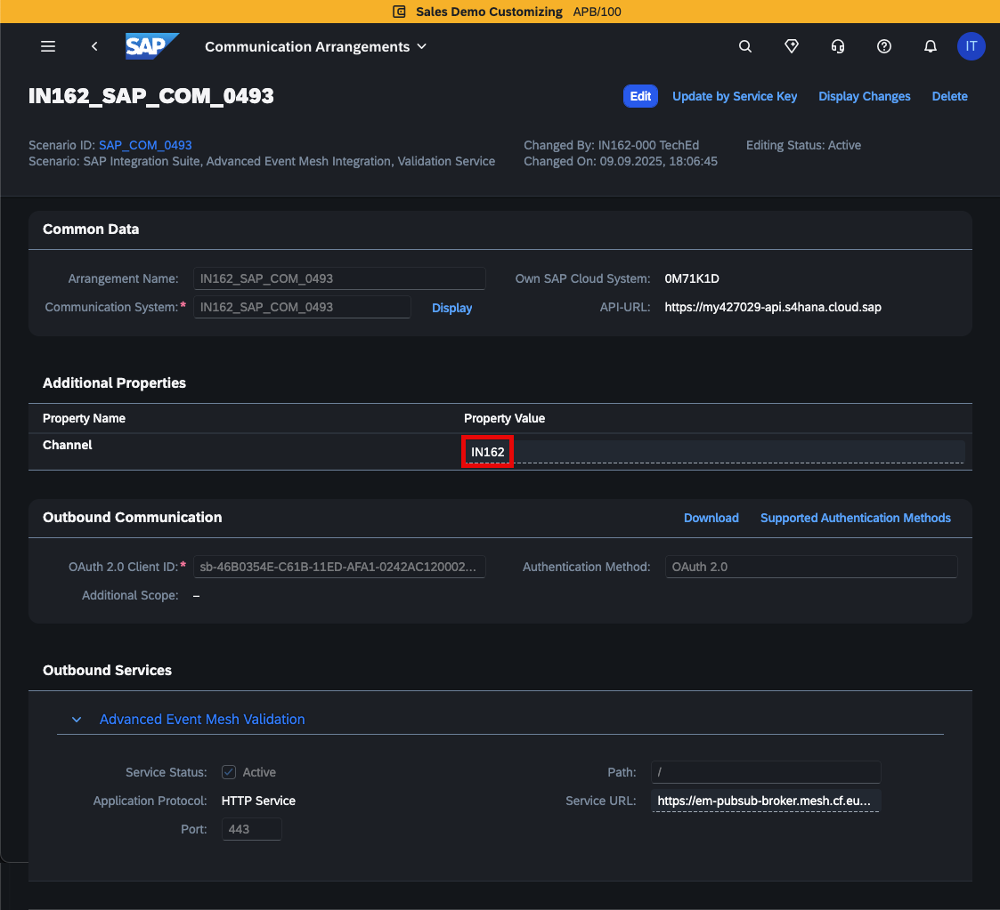
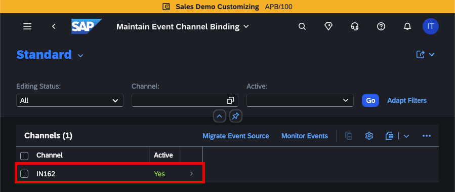
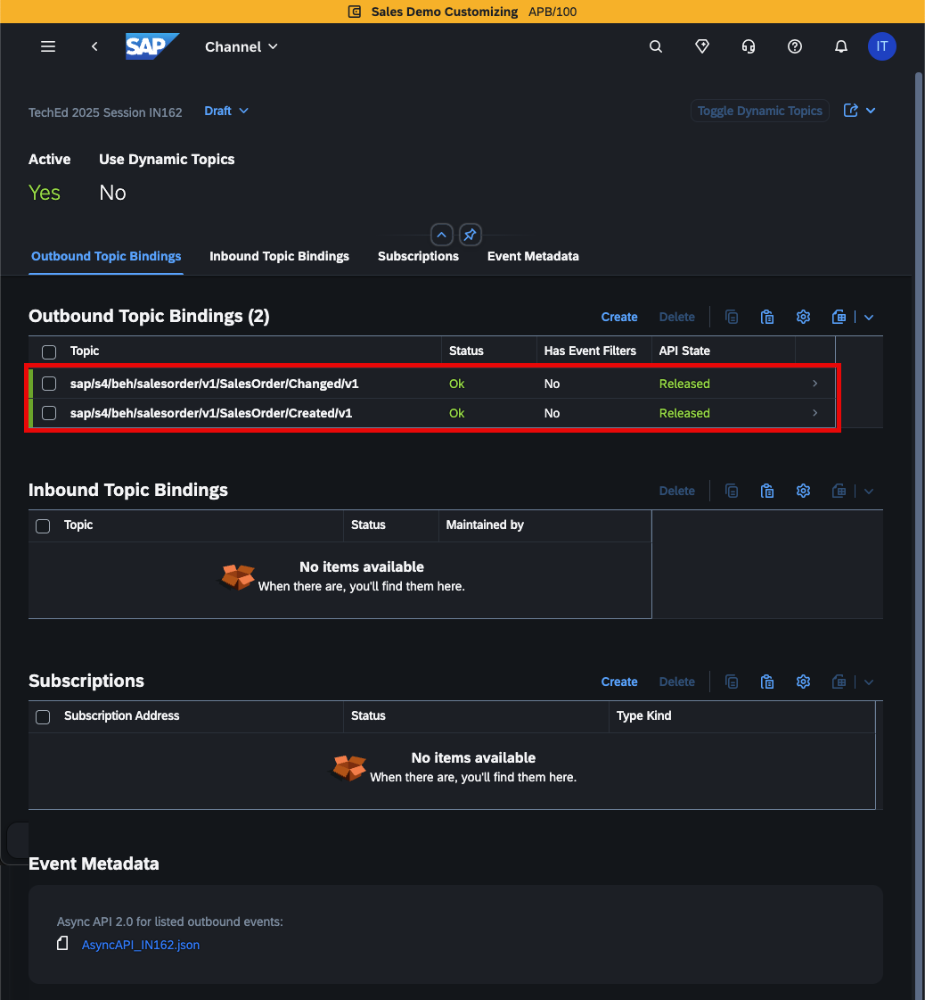

# SAP S/4Hana Cloud System configuration (for your information only)

As per the scenario, we need to create a new **Sales Order (SO)** in **SAP S/4HANA Cloud** system.\
This will publish an event to **SAP Integration Suite, advanced event mesh** from where it will be subscribed by a **SAP Integration Suite integration flow**. As the standard Sales Order business event is only notification event, the integration flow will call the **Sales Order API** to fetch additional details. 

Details about the [Sales Order API](https://api.sap.com/api/CE_SALESORDER_0001/overview) and the [Sales Order Events](https://api.sap.com/event/CE_SALESORDEREVENTS/overview) can be found in the [SAP Business Accelerator Hub](https://api.sap.com/).

To enable the publishing of **Sales Order event** to **SAP Integration Suite, advanced event mesh** and to invoke the **Sales Order API**, the following communication arrangements have already been created in **SAP S/4HANA Cloud** system for you. 

**This section is just for your knowledge and information only.**

## Sales Order Integration - SAP_COM_0109 Communication Scenario

To enable the Sales Order API, we have already created a Communication Arrangement using the Communication Scenario **SAP_COM_0109** in the **SAP S/4HANA Cloud** system with a valid Communication System and Inbound Communication.\
We then utilized the Sales Order API and communication user credentials in the Cloud Integration capability of the SAP Integration Suite.

To know more about how to create a Communication Arrangement in SAP S/4HANA Cloud system, kindly check the [help documentation link](https://help.sap.com/docs/SAP_S4HANA_CLOUD/03c04db2a7434731b7fe21dca77440da/a5550ea977b24a6eb6ce1ce832088567.html).

## SAP Integration Suite, Advanced Event Mesh Integration - SAP_COM_0492 Communication Scenario

With the SAP Event Mesh Advanced Plan, you can connect directly to your own SAP AEM instance. You can use SAP Event Mesh Advanced Plan for very large projects, where performance is crucial.

If you have a valid subscription to the SAP Integration Suite, advanced event mesh, you can use the Virtual Message Router (VMR) endpoint of SAP AEM broker obtained from the SAP AEM Console UI. The SAP AEM's validation service then only checks if a valid SAP AEM broker instance is available. If a valid SAP AEM instance is available, a direct connection to this instance is established.

The communication scenario **SAP_COM_0492** is the prerequisite for **SAP_COM_0493** communication scenario. To integrate with the SAP Integration Suite, advanced event mesh service, you need to create both the scenarios.

To connect your SAP S/4HANA Cloud system with the SAP AEM broker, we have already uploaded the client certificate to the SAP AEM broker. Detailed steps can be found [here](https://help.sap.com/docs/SAP_S4HANA_CLOUD/0f69f8fb28ac4bf48d2b57b9637e81fa/fb42288c6b144520a7c58c9721ce5ded.html?version=2508.500).

- The **Channel** name is required in the next steps to configure topic bindings.
- A **Description** is optional
- The **Topic Space** is the identifier for events that originate from the same source.
- The **QoS (Quality of Service)** default value is 1 (At least once delivery).
- The Number of **Publish Connections** defines the number of available parallel connections to the SAP AEM broker for this channel. The default value is 1, the maximum value is 10.
- The default value of the **Reconnection Attempts** is 0. The framework tries to reconnect infinitely (until the connection is reestablished).
- The **Outbound Communication** is defined in the underlying Communication System.

You can use the **Check Connection** button to verify that your configuration is correct and end to end communication is working. 

Details for each parameter can be found in the [help](https://help.sap.com/docs/SAP_S4HANA_CLOUD/0f69f8fb28ac4bf48d2b57b9637e81fa/f319b6ea517c4d6cbd326ceb59a082cb.html?version=2508.500).

> [!IMPORTANT]
> Note that the connection to the SAP Integration Suite, advanced event mesh only becomes active after creation of **SAP_COM_0493** communication scenario.

## SAP Integration Suite, Advanced Event Mesh Integration, Validation Service - SAP_COM_0493 Communication Scenario

This Communication Arrangement is needed to validate the SAP AEM broker destination URL.

During creation process of **SAP_COM_0493** you need to provide the SAP AEM **Service Key** from SAP BTP Cockpit and the **Channel** that we created in **SAP_COM_0492**.

Details for each parameter can be found in the [help](https://help.sap.com/docs/SAP_S4HANA_CLOUD/0f69f8fb28ac4bf48d2b57b9637e81fa/42c97263becd4aeb9932499db666c7d2.html?version=2508.500).

## Enterprise Event Enablement - Configure Channel Binding

You can define which event types shall be published or consumed using a connection defined through the communication arrangement. Each event type is assigned to one topic. Topics form a logical tree to organize events, such as a folder hierarchy in a file system. Thus, the topics appear as strings that consist of multiple segments and are separated by one defined delimiter, similar to file paths.

The **Enterprise Event Enablement ‒ Configure Channel Binding** app in SAP S/4Hana Cloud displays all the channels that have been created in this system.

We have added multiple **SalesOrder** events to our channel **IN162**.
In our scenario we will only use the **sap/s4/beh/salesorder/v1/SalesOrder/Created/v1** events. It is to demonstrate that multiple events, even originating from multiple business objects can be combined in one channel.

> [!TIP]
> The final topic that will be used to publish the Sales Order event will consist of **\<topic-space\> / \<event-topic\>**. The **Topic Space** is defined in **SAP_COM_0492**. 
> The topic used in our scernaio will look like: **sap/teched/2025/sap/s4/beh/salesorder/v1/SalesOrder/Created/v1**

## Summary

You should now be familiar with all the configurations that have been done in the SAP S/4Hana Cloud system to enable the Sales Order event and API.

Now, to learn more about the configuration that has been done in SAP Service Cloud Version 2 System, you can navigate to [SAP Service Cloud Version 2 System Configuration]((/intro/intro3/README.md)) section.
