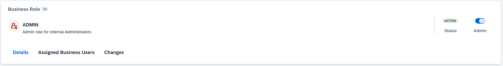
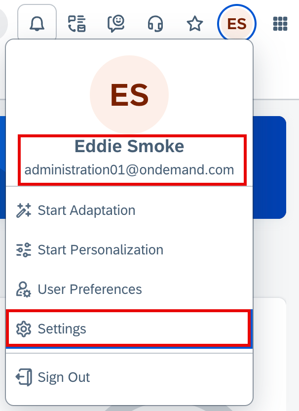
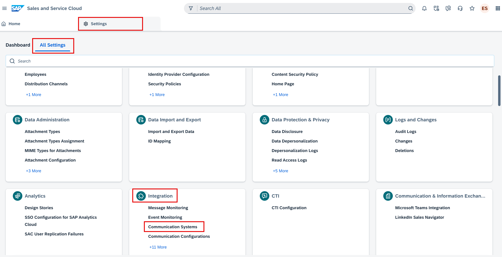
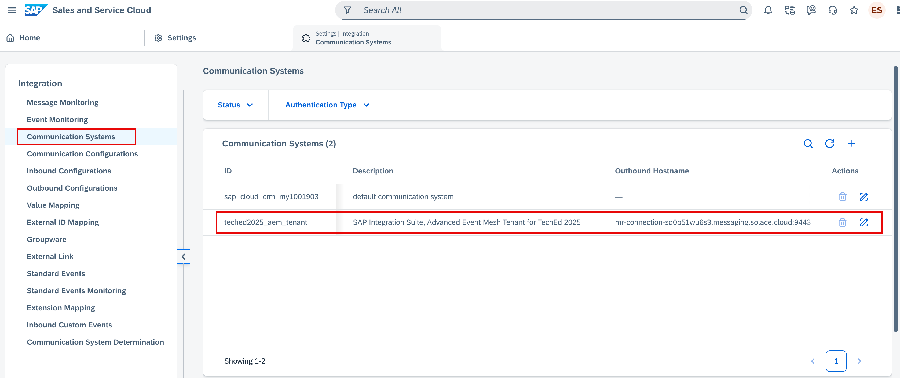
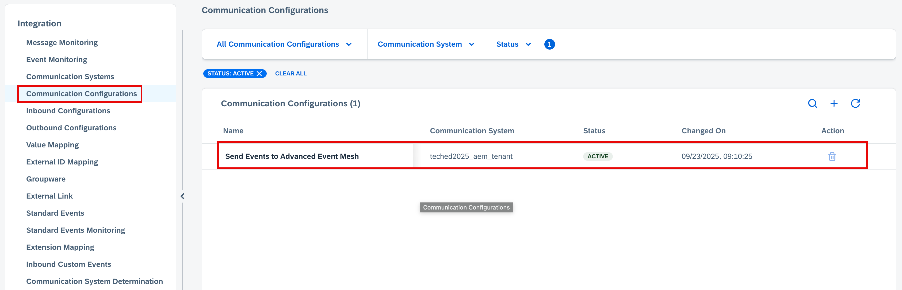
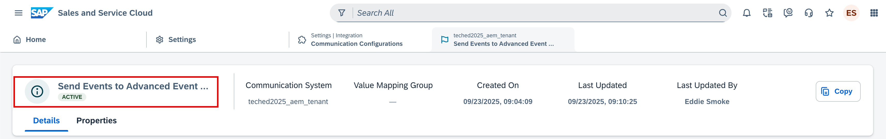
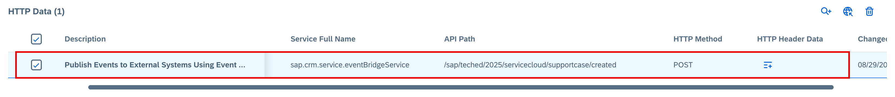
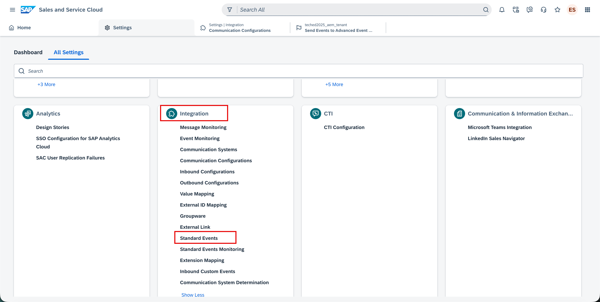
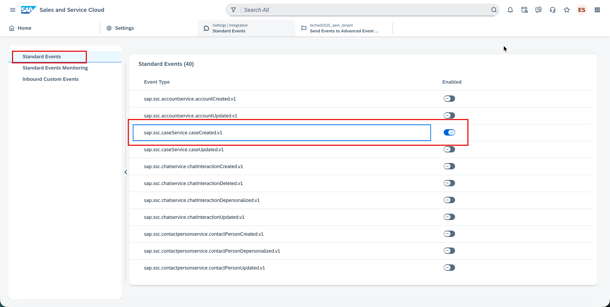
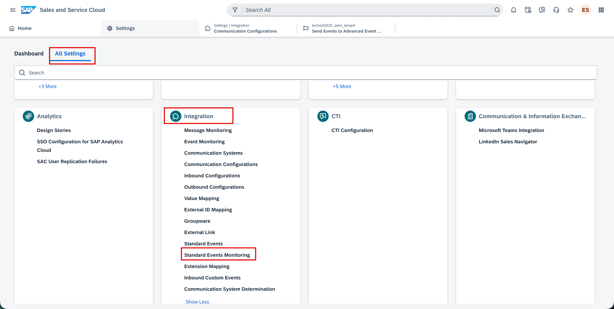

# SAP Service Cloud Version 2 System Configurations (for your information only)

As per the scenario, we also need to create a new **Support Case** in **SAP Service Cloud Version 2** system.
This will **publish an event** to **SAP Integration Suite, advanced event mesh** from where it will be subscribed by a **SAP Integration Suite integration flow**. Although the standard Support Case business event is the data event but still the integration flow will call the Support Case API to fetch the additional details.

To enable the publishing of **Support Case event** to **SAP Integration Suite, advanced event mesh**, the following configuration steps have already been completed in **SAP Service Cloud Version 2** system for you. Details of the procedure can be found [here](https://help.sap.com/docs/CX_NG_SVC/56436b4e8fa84dc8b4408c7795a012c4/6baf9c8623ed410f9df51d48b33a6f6a.html).

**This section is just for your knowledge and information only.**

## Configurations for dispatching outbound events to SAP Integration Suite, advanced event mesh

1. Assigned the **sap.crm.service.eventBridgeService** business service to **Admin** user role that is assigned to **ADMINISTRATION01** business user to **enable Standard Events and Standard Events Monitoring UI** in the Admin Settings.

   
   
   
3. Then navigated to **User Menu -> Settings -> All Settings  -> Integration -> Communication Systems**

   

   

4. Created a **Communication System - "teched2025_aem_tenant"** and maintained the hostname and the credentials of the **SAP Integration Suite, advanced event mesh** to which the events must be dispatched. You can use the REST endpoint of SAP AEM broker obtained from the SAP AEM. Activate the communication system.

   
   
5. Next, in the **Communication Configuration** page, **Send Events to External Systems** has been configured.\
   a. Open the **Communication Configuration**,  **Send Events to External Systems**, and select **Copy**.\
   b. In the copied Communication Configuration, select the **Communication System - "teched2025_aem_tenant"** that we created in step 4.\
   c. In the same Communication Configuration, under the **HTTP Data section**, maintain the **API path** that specify the **Topic** of the **SAP Integration Suite, advanced event mesh**\
   d. Activate the Communication Configuration.\
   c. The **host_name of the Communication System + API Path** is where the outbound events is dispatched. The event payload is dispatched to the configured endpoint as an HTTP POST call.

   
   
   
   
6. Under **Admin Settings -> Integration -> Standard Events**, enabled the events to be dispatched.

   
   
 
7. You've now configured the event processing, and the events raised by the application services are dispatched to the configured end point.

8. Navigate to **Admin Settings -> Integration -> Standard Events -> Monitoring** to monitor the outbound events, if in case of any errors.

   
   
>Note
>Outbound events are always dispatched in order. If for a given entity, an earlier event failed to be processed successfully, even after retry, then such events are moved to ABORTED status. Subsequent events for the same entity instance remain in >PENDING status. The resend functionality is only enabled for ABORTED events. With the resend functionality, such ABORTED events can be retried manually from the Standard Events monitoring and if the retry succeeds, then, the subsequent PENDING events >corresponding to the entity instance are dispatched automatically later by the system.

## Summary

You've now ...

Continue to - [Exercise 2 - Exercise 2 Description](../ex2/README.md)

